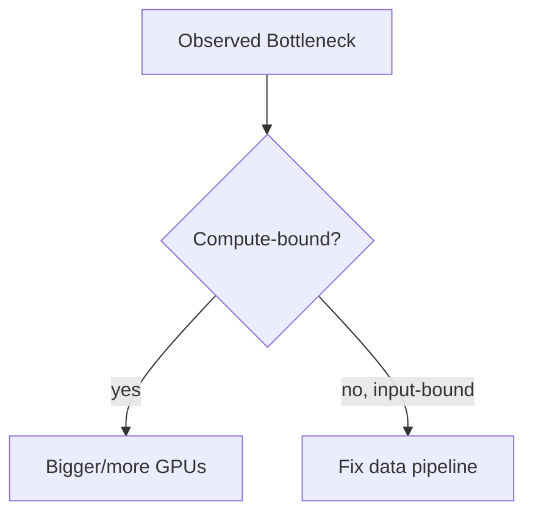

# Training Infrastructure and Cost

The training bill arrives, and most of it bought idle GPU time — a genuinely common outcome, and an entirely preventable one. Utilisation, not hourly rate, decides training cost: a half-idle expensive GPU beats neither a well-fed cheap one nor, often, a smaller model trained more efficiently.

:::info[Key idea]
Utilisation, not hourly rate, decides training cost - a half-idle expensive GPU beats neither a well-fed cheap one nor a smaller model.
:::

## Where the money goes: compute, storage, egress, idle time

**Compute**: the GPU/CPU hours actually used. **Storage**: datasets, checkpoints, and logged artefacts accumulating over time. **Egress**: data transfer costs, often underestimated, particularly moving large datasets or model weights between regions or providers. **Idle time**: paid-for compute sitting unused between jobs, or during a job that's bottlenecked elsewhere — frequently the largest, least visible line item.

## GPU selection by memory and throughput rather than by name

Choosing hardware by brand recognition or "the newest one" skips the two numbers that actually matter: whether the model and batch fits in the GPU's memory at all, and its throughput (relevant operations per second) for the actual workload — a cheaper GPU with adequate memory and throughput for the task beats an expensive one whose extra capability goes unused.

## Spot and preemptible instances, and the checkpointing discipline they demand

**Spot/preemptible instances** offer substantially lower prices in exchange for the provider being able to reclaim the instance with little notice. Using them safely requires **checkpointing** frequently enough that a preemption loses only a small amount of progress, and a training script that can resume cleanly from the latest checkpoint — without this discipline, spot instances' savings are easily wiped out by repeated lost progress.

## Measuring utilisation, and the usual answer (input-bound)

**Utilisation** measures what fraction of the time the GPU is actually doing compute, versus idle. The frequent, often-surprising finding: many training jobs are **input-bound** — the GPU sits idle waiting for the data pipeline (disk I/O, preprocessing, augmentation) to supply the next batch — meaning the fix is a faster data pipeline, not a faster (or more) GPU.

## Scaling up vs. scaling out, with the decision rule

**Scaling up**: a bigger single GPU (more memory, more throughput). **Scaling out**: more GPUs in parallel, via [Distributed Training](../02-deep-learning/distributed-training.md). The decision rule: scale up first, while it's still possible (simpler, no communication overhead) — scale out only once a single GPU genuinely can't fit the model or reach acceptable throughput on its own, since distributed training introduces real complexity and communication cost that a single bigger GPU avoids entirely.

## Job scheduling and queueing

In shared infrastructure, a **scheduler** allocates available hardware across competing jobs, typically via priority queues and resource quotas — understanding the scheduler's policy (priority, preemption rules, quota limits) is often necessary to understand why a job waited longer than expected, independent of anything about the job itself.

## The cost of hyperparameter search, and cheaper search strategies

A naive grid search over hyperparameters multiplies training cost by every combination tried — [Model Selection and Tuning](../01-classical-ml/model-selection-and-tuning.md)'s cheaper alternatives (random search, successive halving, Bayesian optimisation) directly reduce this multiplier by allocating compute toward more promising configurations and abandoning poor ones early, rather than running every combination to completion.

## Cost attribution per experiment

Tagging every training job with its owning experiment or team (connecting to [Experiment Tracking](./experiment-tracking.md)'s run metadata) makes it possible to see *which* work is actually driving the training bill — without this, cost conversations happen at the aggregate level, where no specific actionable change is visible.

## Setting a budget and a kill switch

An explicit budget per experiment or team, paired with an automatic **kill switch** that stops a job exceeding it, prevents a single misconfigured or runaway job (an infinite retry loop, an accidentally-oversized sweep) from silently consuming a large, unbounded amount of spend before anyone notices.

## The frequently correct answer: use a smaller model or less data

Before reaching for more or better hardware, it's worth asking whether the actual goal can be met with a smaller model or less training data — [Model Capacity and Scaling](../02-deep-learning/model-capacity-and-scaling.md)'s diminishing returns mean the marginal accuracy gain from more compute is often small relative to its cost, and a right-sized model trained efficiently is frequently both cheaper and easier to operate than a larger one trained on more (and more expensive) hardware.

$$
\text{cost per run} = \text{hourly rate} \times \text{wall time} \times \text{instances}
$$

Reported alongside **cost per unit of metric improvement** — the actual decision figure, since raw cost per run says nothing about whether the spend was worth it.



| Symbol | Meaning |
|---|---|
| utilisation | fraction of time the GPU is actually computing, not idle |
| spot instance | discounted, preemptible compute |

## Code: a training-run cost estimator and a GPU utilisation logger

```python title="training_cost_demo.py"
import time

def estimate_cost(hourly_rate: float, step_time_seconds: float, n_steps: int, n_instances: int = 1) -> dict:
    wall_time_hours = (step_time_seconds * n_steps) / 3600
    total_cost = hourly_rate * wall_time_hours * n_instances
    return {
        "wall_time_hours": round(wall_time_hours, 3),
        "total_cost_usd": round(total_cost, 2),
    }

# --- Estimate the cost of a training run before launching it ---
estimate = estimate_cost(hourly_rate=2.50, step_time_seconds=0.8, n_steps=50_000, n_instances=1)
print(f"estimated run cost: ${estimate['total_cost_usd']} over {estimate['wall_time_hours']}h")

def cost_per_metric_point(cost_usd: float, baseline_metric: float, new_metric: float) -> float:
    """Cost per unit of metric improvement — the figure that actually matters for a decision."""
    improvement = new_metric - baseline_metric
    if improvement <= 0:
        raise ValueError("no improvement achieved, cost-per-point is undefined")
    return cost_usd / improvement

cost_efficiency = cost_per_metric_point(cost_usd=125.0, baseline_metric=0.82, new_metric=0.85)
print(f"cost per 1.0 point of accuracy improvement: ${cost_efficiency:.2f}")

# --- A minimal utilisation logger, sampling GPU usage during a run ---
def utilisation_logger(sample_fn, n_samples=100, interval_seconds=1.0):
    """sample_fn should return a 0-100 utilisation reading, e.g. from nvidia-smi or a monitoring API."""
    samples = []
    for _ in range(n_samples):
        samples.append(sample_fn())
        time.sleep(0)  # placeholder: real usage would sleep(interval_seconds) between samples
    mean_utilisation = sum(samples) / len(samples)
    return mean_utilisation

# --- Synthetic sampling function standing in for a real GPU monitoring call ---
import random
rng = random.Random(0)
synthetic_utilisation = utilisation_logger(lambda: rng.uniform(30, 60), n_samples=50)
print(f"\nmean GPU utilisation: {synthetic_utilisation:.1f}%  "
      f"(well below 90%+ suggests an input-bound pipeline, not a compute-bound one)")
```

## See also

- [GPU Training and Mixed Precision](../02-deep-learning/gpu-training-and-mixed-precision.md) — the throughput techniques this page's cost model assumes are already applied.
- [Model Selection and Tuning](../01-classical-ml/model-selection-and-tuning.md) — cheaper search strategies that directly reduce hyperparameter-search cost.
