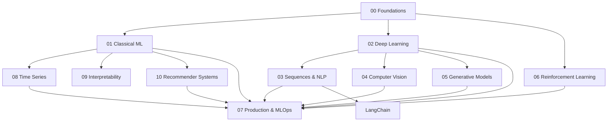

# Machine Learning

This section is a deep, self-contained curriculum covering machine learning from first principles through to production deployment: the mathematical foundations, classical algorithms, deep learning, sequence models and LLMs, computer vision, generative models, reinforcement learning, and the systems engineering needed to run any of it in production.

:::info[How to use this section]
Follow one of the paths below rather than reading the sidebar top to bottom. Each section builds on [Foundations](./00-foundations/what-is-machine-learning.md); most later sections only need Foundations plus one or two others, not the whole tree.
:::

## Three learning paths

| Path | Section sequence | What you can build at the end |
|---|---|---|
| Foundations first | [Foundations](./00-foundations/what-is-machine-learning.md) → [Classical ML](./01-classical-ml/linear-regression.md) → [Deep Learning](./02-deep-learning/from-perceptron-to-mlp.md) | Train and evaluate models on tabular data, from a linear baseline through a tuned deep network |
| Deep learning / LLM | [Foundations](./00-foundations/what-is-machine-learning.md) → [Deep Learning](./02-deep-learning/from-perceptron-to-mlp.md) → [Sequences & NLP](./03-sequence-and-nlp/text-preprocessing-and-tokenization.md) → [LangChain](./langchain/00-overview/what-is-langchain.md) | Fine-tune and serve a language model, and build an LLM-powered application on top of it |
| Applied practitioner | [Foundations](./00-foundations/what-is-machine-learning.md) → [Classical ML](./01-classical-ml/linear-regression.md) → [Production & MLOps](./07-production-mlops/from-notebook-to-production.md) | Ship a model to production and keep it monitored, versioned, and safe to roll back |

## How the sections depend on each other

[Foundations](./00-foundations/what-is-machine-learning.md) underlies everything else. [Deep Learning](./02-deep-learning/from-perceptron-to-mlp.md) is the shared base for [Sequences & NLP](./03-sequence-and-nlp/text-preprocessing-and-tokenization.md), [Computer Vision](./04-computer-vision/images-as-tensors.md), and [Generative Models](./05-generative-models/what-is-a-generative-model.md). [Time Series](./08-time-series/what-makes-time-series-different.md) and [Recommender Systems](./10-recommender-systems/the-recommendation-problem.md) are applied domains that lean mostly on Classical ML. [Production & MLOps](./07-production-mlops/from-notebook-to-production.md) sits downstream of all of them — it's about deploying and operating whatever model the earlier sections produced.

## The eleven sections

| Section | Pages | Description | Start here |
|---|---|---|---|
| Foundations | 17 | Math, statistics, and the core concepts every other section assumes | [What Is Machine Learning](./00-foundations/what-is-machine-learning.md) |
| Classical ML | 20 | Regression, classification, trees, ensembles, clustering, and dimensionality reduction | [Linear Regression](./01-classical-ml/linear-regression.md) |
| Deep Learning | 18 | Neural networks from a single perceptron through training at scale on GPUs | [From Perceptron to MLP](./02-deep-learning/from-perceptron-to-mlp.md) |
| Sequences & NLP | 16 | Tokenization through transformers, pretraining, fine-tuning, and decoding | [Text Preprocessing and Tokenization](./03-sequence-and-nlp/text-preprocessing-and-tokenization.md) |
| Computer Vision | 13 | Convolutions, CNN architectures, detection, segmentation, and vision transformers | [Images as Tensors](./04-computer-vision/images-as-tensors.md) |
| Generative Models | 11 | Autoencoders, VAEs, GANs, normalizing flows, and diffusion models | [What Is a Generative Model](./05-generative-models/what-is-a-generative-model.md) |
| Reinforcement Learning | 12 | MDPs, value-based and policy-gradient methods, PPO, and RLHF | [The Reinforcement Learning Problem](./06-reinforcement-learning/rl-problem-setup.md) |
| Time Series & Forecasting | 5 | Stationarity, ARIMA, ML-based forecasting, and backtesting without leakage | [What Makes Time Series Different](./08-time-series/what-makes-time-series-different.md) |
| Interpretability | 4 | Feature importance, PDP/ICE, SHAP, LIME, counterfactuals, and how they mislead | [Why Interpretability Matters](./09-interpretability/why-interpretability-matters.md) |
| Recommender Systems | 4 | Collaborative filtering, matrix factorization, hybrids, and ranking metrics | [The Recommendation Problem](./10-recommender-systems/the-recommendation-problem.md) |
| Production & MLOps | 16 | Data pipelines, experiment tracking, serving, monitoring, and responsible AI | [From Notebook to Production](./07-production-mlops/from-notebook-to-production.md) |

See the [LangChain reference](./langchain/00-overview/what-is-langchain.md) for building LLM-powered applications on top of the models this section covers.

:::tip[Conventions used across these docs]
- **Figures over diagrams.** Concepts are illustrated with real plots wherever one can be drawn — decision boundaries, loss surfaces, gradient flow, attention maps. Every figure is generated from source by the scripts in `tools/figures/`, so it matches the page it sits on, and several are genuine computations rather than illustrations: the gridworld values come from running value iteration, the cliff-walking paths from running Q-learning and SARSA. The full inventory is in `static/img/ml/CREDITS.md`.
- Mermaid is kept for flows and state machines, where there is nothing to plot.
- Tables are preferred over prose for comparisons.
- Admonitions flag the important parts: `info` for the key idea, `warning`/`danger` for genuine foot-guns — leakage, silent miscalibration, metrics that mislead.
- Every page ends with **See also** links, and most carry a runnable, dependency-light code block that demonstrates the idea rather than wrapping a library call.
:::
