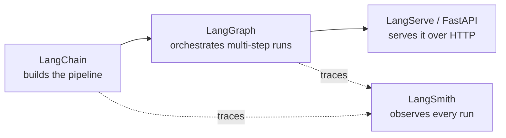

# The LangChain ecosystem

"LangChain" is often used loosely to mean four separate projects that compose together: LangChain
itself, LangGraph, LangSmith, and LangServe.

| Project | What it does | You need it when | Covered in |
| --- | --- | --- | --- |
| **LangChain** | Building blocks: chat models, prompts, retrieval, tools, output parsing | You're assembling any LLM-powered pipeline | This whole section |
| **LangGraph** | Stateful, cyclic orchestration of agents and multi-step workflows | Your flow loops, branches on model decisions, or needs to pause/resume | [Why LangGraph](../07-langgraph/why-langgraph.md) |
| **LangSmith** | Tracing, evaluation, and prompt management | You need to see what a chain/agent actually did, or regression-test prompt changes | [Tracing](../09-langsmith/tracing.md) |
| **LangServe** | Exposing a Runnable as an HTTP API | You're serving a chain over HTTP and want schemas/streaming for free | [LangServe](../10-deployment/langserve.md) |

## How they relate at runtime

LangChain supplies the components. LangGraph decides the control flow when a single linear chain
isn't enough. LangSmith watches both, regardless of which one is running. LangServe (or a
hand-rolled FastAPI app) puts the result behind an HTTP endpoint.

:::tip
You don't need all four for every project. A single retrieval-augmented chain is LangChain alone.
An agent that loops and calls tools usually reaches for LangGraph. Tracing is worth turning on
early, even in development — see [LangSmith tracing](../09-langsmith/tracing.md).
:::

## See also

- [What is LangChain?](./what-is-langchain.md)
- [When not to use LangChain](./when-not-to-use.md)
