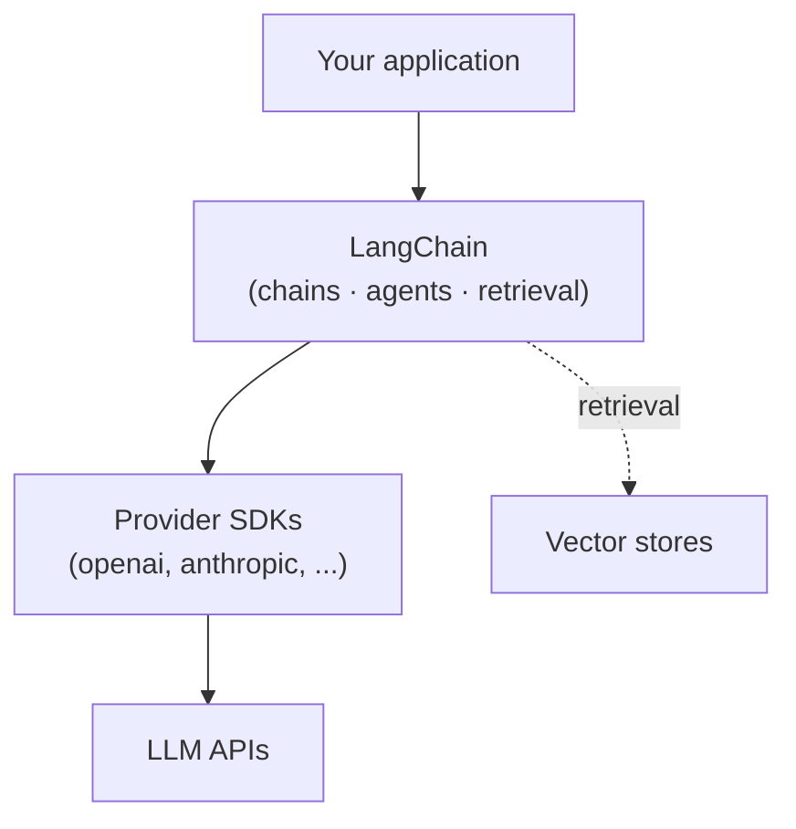

# What is LangChain?

A raw call to an LLM provider's API gives you one thing: text in, text out. Nearly every real
application needs more than that — a system prompt assembled from templates, a way to give the
model tools it can call, documents to search before answering, a running conversation, and a way
to see what actually happened when something goes wrong. LangChain is the composition layer that
supplies those pieces so you don't rebuild them per project.

:::info[Key idea]
LangChain is a composition layer over model providers, not a model itself. It standardizes how
prompts, models, tools, retrieval, and output parsing plug into each other so the same code can
swap a provider, add a tool, or add retrieval without a rewrite.
:::

## What it gives you

- **A uniform model interface** — `init_chat_model` and the chat model classes expose the same
  `invoke` / `stream` / `batch` surface regardless of which provider is behind them.
- **Composable pipelines (LCEL)** — prompt, model, and parser chain together with `|`, and the
  resulting pipeline is itself invokable, streamable, and batchable.
- **Retrieval building blocks** — loaders, splitters, embeddings, and vector store integrations for
  retrieval-augmented generation.
- **Tool calling and agents** — a standard way to describe tools to a model and route the model's
  tool-call requests back to your code.
- **Observability** — traces of every step in a chain or agent run, via LangSmith.

## What you still write

LangChain does not decide your product's prompts, your retrieval strategy, your data model, or
your error-handling policy. It gives you typed building blocks; the judgment calls — which chunks
to retrieve, when an agent should stop, what counts as a safe tool call — stay yours.

## The stack

Your application code calls into LangChain's abstractions; LangChain calls into each provider's
SDK; the SDK talks to the provider's API. Retrieval branches off to a vector store instead of (or
alongside) the model call.

## See also

- [Ecosystem map](./ecosystem-map.md) — how LangGraph, LangSmith, and LangServe relate to LangChain.
- [When not to use LangChain](./when-not-to-use.md) — when the raw SDK is the better call.
- [Versions and migration](./versions-and-migration.md) — the version this section documents.
