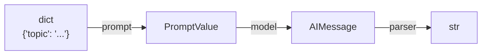

# Your First Chain

A minimal chain: a prompt template feeds a chat model, whose output feeds a parser. The `|` operator wires them together.

```python
from langchain.chat_models import init_chat_model
from langchain_core.output_parsers import StrOutputParser
from langchain_core.prompts import ChatPromptTemplate

prompt = ChatPromptTemplate.from_template(
    "Explain {topic} in one sentence for a beginner."
)
model = init_chat_model("gpt-4o-mini", model_provider="openai")
parser = StrOutputParser()

chain = prompt | model | parser

result = chain.invoke({"topic": "vector embeddings"})
print(result)
```

## What's happening

1. **`prompt`** takes a dict (`{"topic": "..."}`) and fills the template, producing a `PromptValue`.
2. **`model`** takes that `PromptValue`, calls the LLM, and returns an `AIMessage`.
3. **`parser`** takes the `AIMessage` and extracts just the string content.

`|` doesn't call anything — it builds a `RunnableSequence` object. Nothing runs until `.invoke(...)` is called on the composed chain.



Every piece in this chain implements the same `Runnable` interface — that's why `|` works uniformly regardless of what's on either side of it. That interface, and the rest of what a Runnable can do beyond `invoke`, is covered next.

## See also

- installation.md, keys-and-config.md — getting to the point this snippet assumes.
- Core Primitives → Runnables & LCEL (next section) — the full `Runnable` contract this chain relies on.

