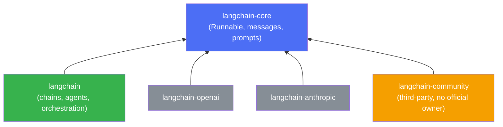

# Package Layout

LangChain's packages form a dependency tree. Understanding the direction of that tree tells you which package to import an abstraction from, and which packages are safe to depend on for the long term.

Every arrow points at `langchain-core`. That is the stability contract:

| Tier | Stability | Import abstractions from it? |
|---|---|---|
| `langchain-core` | Most stable — breaking changes are rare and loudly flagged | Yes. `Runnable`, `BaseMessage`, `BaseChatModel` all live here |
| `langchain` | Stable within a major version | For chains, agents, and orchestration helpers |
| Partner packages (`langchain-openai`, `langchain-anthropic`, ...) | Stable, maintained by the provider or LangChain team | For provider-specific model/embedding classes |
| `langchain-community` | No stability guarantee — anyone can contribute an integration here | Only when no partner package exists for what you need |

:::tip
When you're writing type hints or building an abstraction that should work across providers, import from `langchain-core` (e.g. `from langchain_core.language_models import BaseChatModel`), not from a specific partner package. That is the one piece of the tree every provider package already depends on.
:::

## See also

- installation.md — installing the packages described here.
- keys-and-config.md — configuring the provider packages once installed.
- ../02-core-primitives/runnables-and-lcel.md — the `Runnable` abstraction that `langchain-core` defines.

