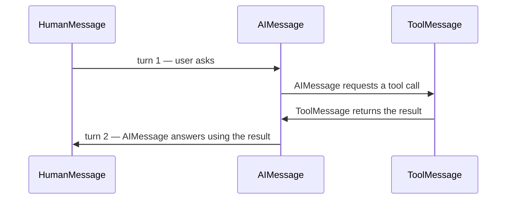

# Messages

A chat model's input and output are both lists of typed message objects, not raw strings. Each message type maps to a role.

| Type | Role | Written by | Purpose |
|---|---|---|---|
| `SystemMessage` | `system` | you, once per chain/conversation | instructions and persona, not user-visible |
| `HumanMessage` | `user` | your application, from user input | the user's turn |
| `AIMessage` | `assistant` | the model | the model's reply — may carry `tool_calls` instead of (or alongside) text |
| `ToolMessage` | `tool` | your application, after executing a tool | the result of a tool call, keyed to a `tool_call_id` |

```python
from langchain.messages import AIMessage, HumanMessage, SystemMessage, ToolMessage

messages = [
    SystemMessage("You can call the get_weather tool."),
    HumanMessage("What's the weather in Lisbon?"),
    AIMessage(
        content="",
        tool_calls=[{"name": "get_weather", "args": {"city": "Lisbon"}, "id": "call_1"}],
    ),
    ToolMessage(content="18°C, partly cloudy", tool_call_id="call_1"),
]

response = model.invoke(messages)  # model now answers using the tool result
```

An `AIMessage` carrying `tool_calls` is the shape the tool-calling loop depends on — see Tool Calling (Tools & Agents section, later in this reference).



## See also

- [Prompt Templates](./prompt-templates.md) — how templates assemble message lists.
- Tool Calling — the round trip that produces `AIMessage.tool_calls` (Tools & Agents section, later in this reference).
