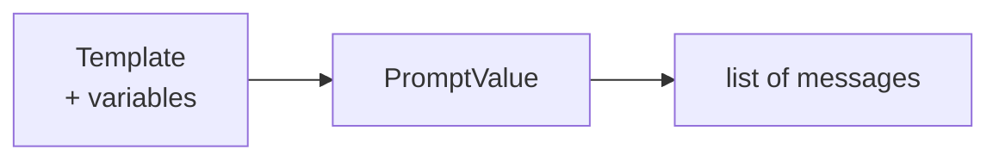

# Prompt Templates

A prompt template turns a dict of variables into a `PromptValue` the model can consume. `ChatPromptTemplate` is the one you'll use almost everywhere; `PromptTemplate` produces a plain string instead of a message list.

```python
from langchain_core.prompts import ChatPromptTemplate

prompt = ChatPromptTemplate.from_messages([
    ("system", "You are a concise technical writer."),
    ("human", "Explain {topic} in {sentences} sentences."),
])

prompt.invoke({"topic": "vector embeddings", "sentences": 2})
```

`ChatPromptTemplate.from_messages` accepts `(role, template)` tuples — `"system"`, `"human"`, `"ai"` — and fills each with the variables passed to `invoke`.

## Conversation history: `MessagesPlaceholder`

To splice a variable-length list of prior messages into a template (chat history, few-shot examples), use `MessagesPlaceholder` instead of a fixed slot:

```python
from langchain_core.prompts import ChatPromptTemplate, MessagesPlaceholder

prompt = ChatPromptTemplate.from_messages([
    ("system", "You are a helpful assistant."),
    MessagesPlaceholder("history"),
    ("human", "{question}"),
])

prompt.invoke({
    "history": [("human", "My name is Ana"), ("ai", "Nice to meet you, Ana!")],
    "question": "What's my name?",
})
```

## Partials and few-shot examples

`prompt.partial(...)` binds a variable ahead of time, useful for values known at chain-build time (a system persona, a date) that shouldn't be re-passed on every `invoke`. For few-shot prompting, build the example block as a formatted string or a list fed through `MessagesPlaceholder`, so adding or swapping examples doesn't require rewriting the template.



:::warning[Pitfalls]
A raw `{` in a template — JSON inside a prompt, a code example with braces — is interpreted as a variable placeholder. Escape it as `{{` and `}}`, or the template will raise a `KeyError` on the literal text.
:::

## See also

- [Messages](./messages.md) — the message objects a template ultimately produces.
- [Your First Chain](../01-setup/first-chain.md) — a template as the first stage of a chain.
