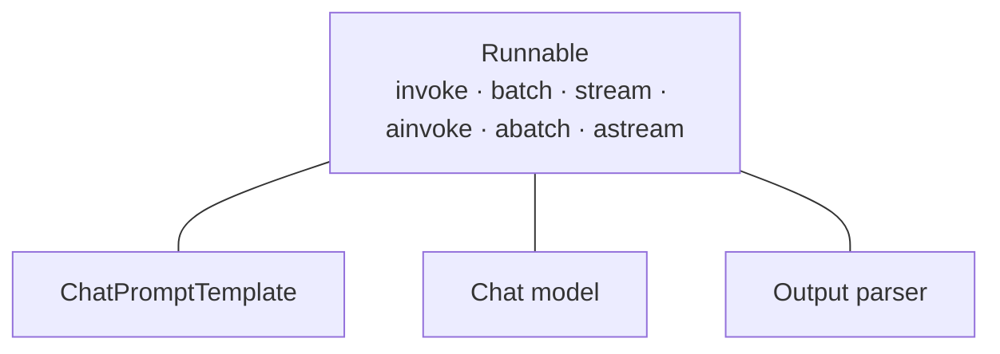

# Runnables and LCEL

Every composable piece in LangChain — prompts, chat models, parsers, retrievers, custom functions — implements the same interface: `Runnable`. LCEL (LangChain Expression Language) is just the `|` operator composing `Runnable`s into a `RunnableSequence`, as shown in [Your First Chain](../01-setup/first-chain.md).

:::info[Key idea]
Uniformity is the whole point. Because a prompt, a model, and a parser all expose the same six methods, any one of them can be swapped, tested, or replaced without touching how it's wired into the rest of the chain.
:::

## The Runnable contract

| Method | Input | Output | Use it when |
|---|---|---|---|
| `invoke` | single input | single output | one-off synchronous call |
| `batch` | list of inputs | list of outputs | many independent inputs, sync context |
| `stream` | single input | iterator of output chunks | you want tokens/partial results as they arrive |
| `ainvoke` | single input | single output (awaitable) | async app, one call |
| `abatch` | list of inputs | list of outputs (awaitable) | async app, many independent inputs |
| `astream` | single input | async iterator of chunks | async app, streaming |

Every `Runnable` — a prompt template, a chat model, an output parser, a retriever, a whole chain — implements all six. Calling `.invoke()` on a `RunnableSequence` built with `|` invokes each step in order, passing each step's output as the next step's input.

```python
from langchain.chat_models import init_chat_model
from langchain_core.output_parsers import StrOutputParser
from langchain_core.prompts import ChatPromptTemplate

prompt = ChatPromptTemplate.from_template("Summarize this in one sentence: {text}")
model = init_chat_model("gpt-4o-mini", model_provider="openai")
parser = StrOutputParser()

chain = prompt | model | parser

# same chain, four different call shapes
chain.invoke({"text": "..."})
chain.batch([{"text": "..."}, {"text": "..."}])
for chunk in chain.stream({"text": "..."}):
    print(chunk, end="", flush=True)
result = await chain.ainvoke({"text": "..."})
```



:::tip
`|` never executes anything — it builds a `RunnableSequence` object. Composition and execution are separate steps; nothing runs until you call `invoke`, `batch`, or `stream`.
:::

## See also

- [Your First Chain](../01-setup/first-chain.md) — the quickstart this page explains in depth.
- Composition — how `|` coerces dicts and plain functions into Runnables (Composition section, later in this reference).
