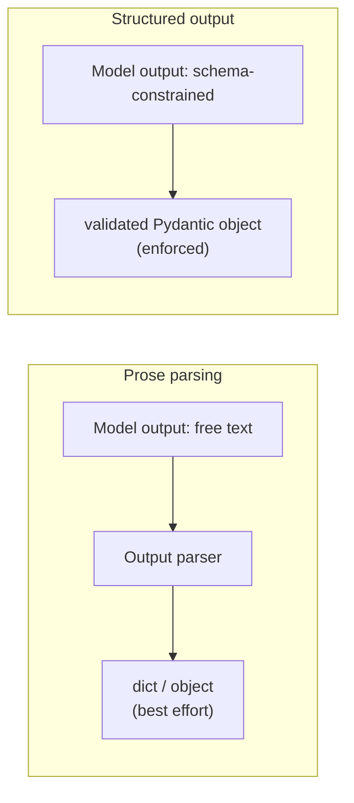

# Structured Output

`with_structured_output` wraps a chat model so it returns a validated Pydantic object instead of prose you then have to parse. The provider enforces the schema at generation time (constrained decoding or native tool-calling), which is far more reliable than [parsing free-form output](./output-parsers.md) after the fact.

```python
from pydantic import BaseModel, Field

class Movie(BaseModel):
    """A movie with details."""
    title: str = Field(description="The title of the movie")
    year: int = Field(description="The year the movie was released")
    director: str = Field(description="The director of the movie")
    rating: float = Field(description="The movie's rating out of 10")

structured_model = model.with_structured_output(Movie)
response = structured_model.invoke("Provide details about the movie Inception")
# Movie(title="Inception", year=2010, director="Christopher Nolan", rating=8.8)
```

Nested schemas work the same way — a `BaseModel` field can itself be a list of `BaseModel`s:

```python
class Actor(BaseModel):
    name: str
    role: str

class MovieDetails(BaseModel):
    title: str
    year: int
    cast: list[Actor]
    genres: list[str]
    budget: float | None = Field(None, description="Budget in millions USD")
```

To keep the raw `AIMessage` alongside the parsed object (for token counts, request IDs, or to inspect a parsing failure), pass `include_raw=True`:

```python
structured_model = model.with_structured_output(Movie, include_raw=True)
result = structured_model.invoke("...")
# {"raw": AIMessage(...), "parsed": Movie(...), "parsing_error": None}
```

## Schema design

- Describe every field with `Field(description=...)` — the description is part of the prompt the model sees.
- Keep schemas flat where you can. Deep nesting degrades extraction quality.
- Prefer enums or `Literal` over free-form strings for anything you'll branch on downstream.



:::warning[Pitfalls]
Structured output is not a silver bullet: validation errors still happen under load with complex schemas, optional fields can silently default instead of signaling "the model didn't know," and deeply nested or very large schemas measurably degrade output quality. Test the schema against real inputs, not just the happy path.
:::

## See also

- [Output Parsers](./output-parsers.md) — the weaker, parse-after-the-fact alternative.
- [Chat Models](./chat-models.md) — the model object `with_structured_output` wraps.
