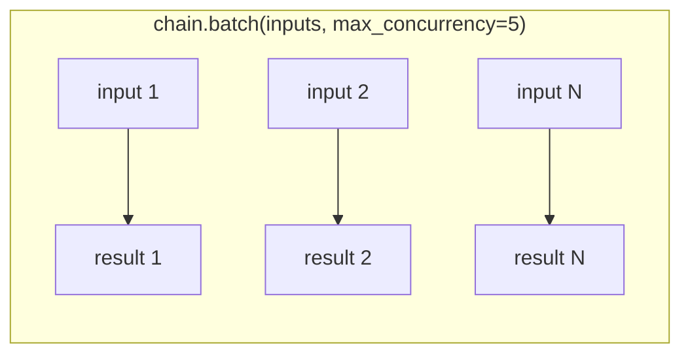

# Async and Batching

Every `Runnable` exposes sync and async twins (`invoke`/`ainvoke`, `batch`/`abatch`, `stream`/`astream`, from [Runnables and LCEL](../02-core-primitives/runnables-and-lcel.md)), plus `batch` for running many independent inputs efficiently.

## ainvoke — async, one call

```python
result = await chain.ainvoke({"text": "Summarize this"})
```

Use the async methods inside an async application (FastAPI, an async worker) so a single in-flight LLM call doesn't block the event loop from handling other requests.

## batch and abatch — many inputs, one call

```python
inputs = [{"text": doc} for doc in documents]
results = chain.batch(inputs, config={"max_concurrency": 5})
```

`batch` sends multiple independent inputs through the chain concurrently and returns results in the same order as the inputs. `max_concurrency` caps how many run in flight at once — without it, LangChain may fire every input at the provider simultaneously.



## Where concurrency actually helps

Concurrency helps when the bottleneck is waiting on I/O — network round trips to the model provider, a vector store query, a database call. It does nothing for CPU-bound work in the same process, and it doesn't make a single call faster, only many independent calls faster in aggregate.

:::warning[Pitfalls]
- **Retry storms.** A wide `batch` call with no `max_concurrency` cap can blow through a provider's rate limit in one shot; every rejected call then retries, multiplying load right when the provider is already struggling. Set `max_concurrency` deliberately, not just "as high as possible."
- **Blocking the event loop.** Calling a *sync* method (`.invoke()`, a blocking HTTP client, `time.sleep`) from inside an async app stalls the whole event loop for every other in-flight request, not just the one making the call. Inside an async application, use `ainvoke`/`abatch`/`astream` throughout, not a sync call bolted into an async function.
:::

## See also

- [Config and Fallbacks](./config-and-fallbacks.md) — `max_concurrency` as part of `RunnableConfig`.
- [Streaming](./streaming.md) — the independent axis of incremental output.
