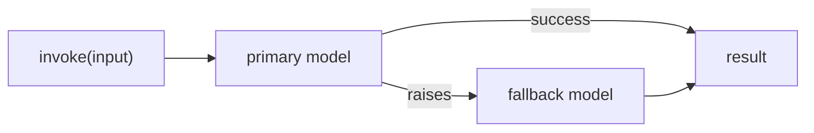

# Retry, Fallbacks, and Runtime Config

Any `Runnable` can be wrapped with retry and fallback behavior, and any call can carry per-invocation configuration — without changing the chain's shape.

## with_retry

```python
resilient_model = model.with_retry(
    stop_after_attempt=3,
)
```

Retries the whole call on failure (network errors, rate limits, transient provider errors). It does not inspect *why* the call failed beyond the exception type — it just tries again.

## with_fallbacks

```python
from langchain.chat_models import init_chat_model

primary = init_chat_model("gpt-4o", model_provider="openai")
backup = init_chat_model("claude-3-5-sonnet-latest", model_provider="anthropic")

resilient_model = primary.with_fallbacks([backup])
resilient_model.invoke("Explain LCEL in one sentence.")
```

If `primary.invoke(...)` raises, LangChain calls `backup.invoke(...)` with the same input and returns its result instead.



:::warning[Pitfalls]
- **Non-idempotent tool calls.** Retrying a chain that already sent an email or wrote a database row on its first (seemingly failed) attempt can execute the side effect twice. Only retry steps that are safe to repeat.
- **Fallbacks masking a misconfigured primary.** If the "primary" provider is silently failing every call (bad key, wrong region), a fallback makes the chain *look* healthy while quietly running on the backup — and the backup's bill — indefinitely. Alert on fallback usage, don't just tolerate it.
:::

## Runtime config

`RunnableConfig` passes tags, metadata, and callbacks into a call without changing the chain definition:

```python
model.invoke(
    "Tell me a joke",
    config={
        "run_name": "joke_generation",
        "tags": ["demo"],
        "metadata": {"user_id": "123"},
        "max_concurrency": 5,  # used by batch()
    },
)
```

`configurable_fields` (and `configurable_alternatives`) go a step further, letting you swap parameters — or the whole model — at call time instead of chain-definition time, which is how one chain definition can serve multiple models or settings per request.

## See also

- [Runnables and LCEL](../02-core-primitives/runnables-and-lcel.md) — the base contract these methods extend.
- [Async and Batching](./async-and-batching.md) — `max_concurrency` in the batch config.
