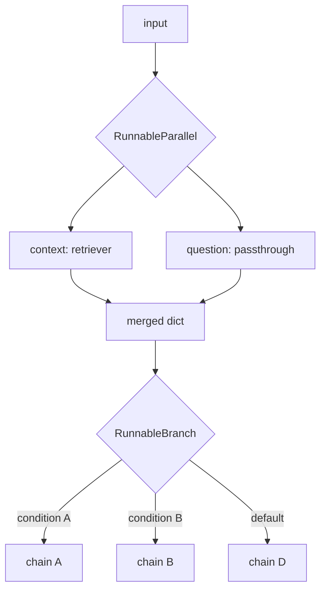

# Parallel Execution and Branching

Real chains are rarely a single straight line. `RunnableParallel` runs several steps against the same input concurrently, `RunnablePassthrough` threads the original input through unchanged so a later step can still see it, and `RunnableBranch` picks one path out of several based on a condition.

## RunnableParallel — fan-out

```python
from langchain_core.runnables import RunnableParallel

chain = RunnableParallel(
    summary=summarize_chain,
    sentiment=sentiment_chain,
)
chain.invoke({"text": "..."})
# {"summary": "...", "sentiment": "..."}
```

:::tip
The dict literal `{"summary": summarize_chain, "sentiment": sentiment_chain}` *is* a `RunnableParallel` — LCEL coerces it automatically. That's the idiom you'll see everywhere in RAG examples, where a chain fans out to `{"context": retriever, "question": RunnablePassthrough()}`.
:::

## RunnablePassthrough — keep the original input

Once a chain transforms its input, the original is gone unless something preserves it. `RunnablePassthrough` is an identity `Runnable` — it just returns whatever it's given — used inside a `RunnableParallel` to carry the original input alongside a derived one.

```python
from langchain_core.runnables import RunnablePassthrough

chain = RunnableParallel(
    context=retriever,
    question=RunnablePassthrough(),
) | prompt | model | parser
```

## RunnableBranch — conditional routing

```python
from langchain_core.runnables import RunnableBranch

branch = RunnableBranch(
    (lambda x: "code" in x["topic"], code_chain),
    (lambda x: "billing" in x["topic"], billing_chain),
    general_chain,  # default, no condition
)
```

Each tuple is `(condition, runnable)`; the first condition that returns truthy wins. The final positional argument (no tuple) is the default.



## See also

- [Pipe Chaining with LCEL](./pipe-chaining.md) — the linear case this builds on.
- Retrieval — `RunnableParallel` is the standard shape for wiring a retriever into a RAG chain (Retrieval & RAG section, later in this reference).
