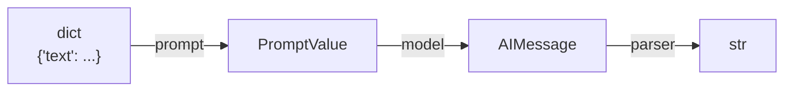

# Pipe Chaining with LCEL

The `|` operator builds a `RunnableSequence`, as introduced in [Runnables and LCEL](../02-core-primitives/runnables-and-lcel.md). Each step's output becomes the next step's input, and the types have to line up — a prompt template's `PromptValue` output must be something the chat model's `invoke` accepts, and so on down the chain.

```python
from langchain.chat_models import init_chat_model
from langchain_core.output_parsers import StrOutputParser
from langchain_core.prompts import ChatPromptTemplate

prompt = ChatPromptTemplate.from_template("Translate to French: {text}")
model = init_chat_model("gpt-4o-mini", model_provider="openai")
parser = StrOutputParser()

chain = prompt | model | parser
chain.invoke({"text": "Good morning"})
```



## Coercion into Runnables

`|` does not require every step to already be a `Runnable`. LCEL coerces two common shapes automatically:

- A **plain function** `def f(x): ...` becomes a `RunnableLambda`.
- A **dict literal** `{"a": step_a, "b": step_b}` becomes a `RunnableParallel` (covered next, in [Parallel and Branching](./parallel-and-branching.md)).

```python
def format_output(text: str) -> str:
    return text.strip().upper()

chain = prompt | model | parser | format_output
```

:::tip
Coercion only happens *inside* a chain built with `|`. A bare function sitting outside a chain is not a `Runnable` and doesn't get `invoke`/`batch`/`stream` — wrap it explicitly with `RunnableLambda` if you need to call it that way on its own.
:::

## See also

- [Runnables and LCEL](../02-core-primitives/runnables-and-lcel.md) — the six-method contract every step here implements.
- [Parallel and Branching](./parallel-and-branching.md) — fan-out with `RunnableParallel`.
