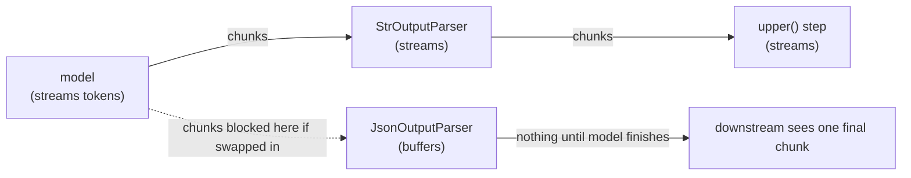

# Streaming

`stream` (sync) and `astream` (async) yield output incrementally instead of waiting for the whole result. For a chat model alone, that means tokens as they're generated:

```python
async for chunk in model.astream("Write a haiku about rivers"):
    print(chunk.text, end="", flush=True)
```

## astream_events — structured, semantic events

`stream`/`astream` give you raw output chunks. `astream_events` gives you typed events for what's happening at each step — useful when a chain has multiple stages and you want to show, say, "retrieving..." then tokens:

```python
async for event in model.astream_events("Hello"):
    if event["event"] == "on_chat_model_start":
        print(f"Input: {event['data']['input']}")
    elif event["event"] == "on_chat_model_stream":
        print(f"Token: {event['data']['chunk'].text}")
    elif event["event"] == "on_chat_model_end":
        print(f"Full message: {event['data']['output'].text}")
```

## The buffering barrier

Not every step in a chain can stream. A step can only pass partial output downstream if it knows how to operate on a partial input — `StrOutputParser` can, because concatenating string chunks is trivial. A step that needs the *complete* output before it can do anything (a JSON parser validating a full document, a step that summarizes the whole response) has to buffer everything first, and every step after it only sees output once that buffering step finishes.



:::warning[Pitfalls]
Putting a non-streaming parser (full-document JSON validation, a summarizer) in the middle of a chain silently kills streaming for everything after it — the UI that expected tokens gets one chunk at the very end instead. If low-latency partial output matters, check every step in the chain for streaming support, not just the model.
:::

## See also

- [Pipe Chaining with LCEL](./pipe-chaining.md) — how chain steps compose.
- [Async and Batching](./async-and-batching.md) — the other axis of concurrency, independent of streaming.
