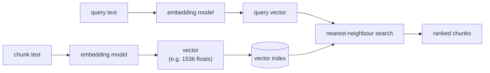

# Embeddings

An embedding model turns text into a fixed-length vector of numbers positioned so that semantically similar text ends up nearby in that vector space. That's the entire mechanism retrieval is built on: instead of matching keywords, you compare vectors.

```python
from langchain_openai import OpenAIEmbeddings

embeddings = OpenAIEmbeddings(model="text-embedding-3-small")
vector = embeddings.embed_query("How many distribution centers does Nike have?")
len(vector)  # e.g. 1536
```

## Why cosine similarity

Two vectors pointing in a similar direction represent semantically similar text, regardless of magnitude — so similarity search typically measures the angle between vectors (cosine similarity), not raw distance. A query embedding and a chunk embedding with a small angle between them are treated as "about the same thing."



## Dimension, cost, and quality

Higher-dimensional embeddings generally capture more nuance but cost more to store and search — a 3072-dimension vector is twice the storage and compute of a 1536-dimension one for a marginal quality gain in most retrieval tasks. Smaller, cheaper embedding models are frequently good enough; benchmark on your own documents before assuming you need the largest available model.

:::danger
The query and every document in the index must be embedded with the **same model**. Vectors from different embedding models aren't comparable — their coordinate spaces don't correspond to each other at all, so mixing them returns nonsense results with no error to warn you. Switching embedding models means a full re-index, not an incremental migration.
:::

## See also

- [Text Splitters](./text-splitters.md) — chunks are what gets embedded.
- [Retrievers](./retrievers.md) — how embedded chunks get searched at query time.
