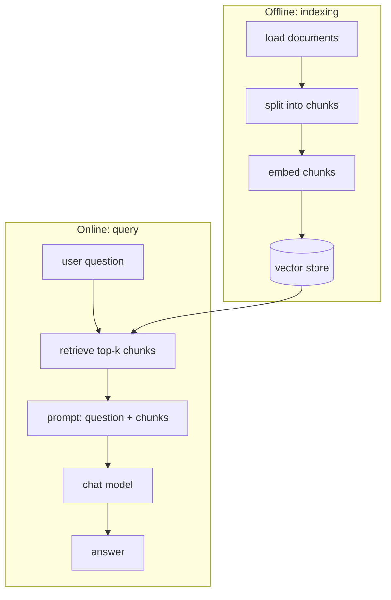

# RAG Pipeline

Retrieval-Augmented Generation combines everything in this section into one flow: load documents, split them, embed them into a searchable index, then at query time retrieve the relevant chunks and hand them to a model alongside the question.

RAG has two distinct phases that run at different times and different frequencies:



Indexing happens once (or on a schedule, as your source documents change); the query path runs on every request.

## A full runnable pipeline

```python
from langchain.chat_models import init_chat_model
from langchain_core.documents import Document
from langchain_core.prompts import ChatPromptTemplate
from langchain_core.runnables import RunnablePassthrough
from langchain_core.vectorstores import InMemoryVectorStore
from langchain_openai import OpenAIEmbeddings
from langchain_text_splitters import RecursiveCharacterTextSplitter

# --- offline: index ---
docs = [
    Document(page_content="Nike was incorporated in 1968.", metadata={"source": "10k.pdf"}),
    # ... more loaded documents
]
splitter = RecursiveCharacterTextSplitter(chunk_size=1000, chunk_overlap=200)
chunks = splitter.split_documents(docs)

embeddings = OpenAIEmbeddings(model="text-embedding-3-small")
vector_store = InMemoryVectorStore(embedding=embeddings)
vector_store.add_documents(chunks)

# --- online: query ---
retriever = vector_store.as_retriever(search_kwargs={"k": 4})
model = init_chat_model("gpt-4o-mini", model_provider="openai")

prompt = ChatPromptTemplate.from_messages([
    ("system", "Answer using only the provided context. If the context doesn't "
               "contain the answer, say you don't know."),
    ("human", "Context:\n{context}\n\nQuestion: {question}"),
])


def format_docs(docs: list[Document]) -> str:
    return "\n\n".join(d.page_content for d in docs)


rag_chain = (
    {"context": retriever | format_docs, "question": RunnablePassthrough()}
    | prompt
    | model
)

rag_chain.invoke("When was Nike incorporated?")
```

The `{"context": ..., "question": ...}` dict is a `RunnableParallel` — see [Parallel Execution and Branching](../03-composition/parallel-and-branching.md) — running the retriever and passing the raw question through side by side, so both are available to the prompt template at once.

:::warning[Pitfalls]
When a RAG answer is wrong, the retriever is the more likely culprit, not the model. Before touching the prompt, print `retriever.invoke(question)` and read what actually got retrieved — a bad chunking strategy or a mismatched query embedding produces confidently wrong answers that look like a model problem but aren't.
:::

## See also

- [Retrievers](./retrievers.md) — the `retriever | format_docs` step in detail.
- [Parallel Execution and Branching](../03-composition/parallel-and-branching.md) — the `RunnableParallel` pattern this pipeline relies on.
- Recipes — a citation-aware version of this pipeline over PDFs (Recipes section, later in this reference).
