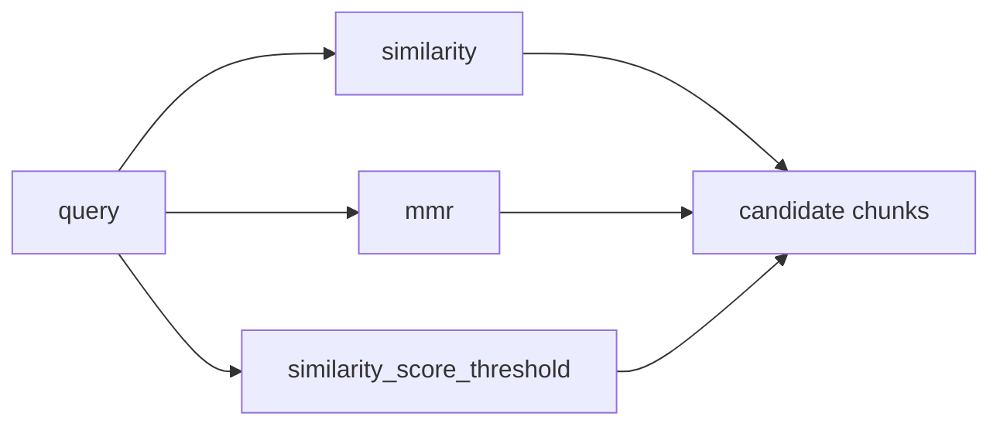

# Retrievers

A retriever is the interface between a query and a candidate set of relevant chunks. Every vector store exposes one through `as_retriever`, which returns a `VectorStoreRetriever` — a `Runnable`, so it composes with `|` like anything else in this reference.

```python
retriever = vector_store.as_retriever(
    search_type="similarity",
    search_kwargs={"k": 4},
)
retriever.invoke("How many distribution centers does Nike have in the US?")
```

## Search strategies

| Strategy | What it fixes | Cost |
| --- | --- | --- |
| `similarity` (default) | Plain nearest-neighbour by cosine distance. | Baseline. |
| `mmr` (maximum marginal relevance) | Near-duplicate results — the top-k similarity hits are often near-identical chunks; MMR re-ranks for relevance *and* diversity so results cover more ground. | Slightly more compute per query; usually worth it once your index has redundant chunks. |
| `similarity_score_threshold` | Returning irrelevant chunks just to fill `k` — this drops anything below a similarity cutoff, even if that means returning fewer than `k`. | Requires tuning a threshold per embedding model. |
| Multi-query expansion | A single phrasing missing relevant chunks — an LLM generates several reformulations of the query, retrieves for each, and merges results. | One extra LLM call per query. |
| Contextual compression | Retrieved chunks containing mostly irrelevant text — a compressor (often an LLM) trims each retrieved chunk down to the parts relevant to the query before it reaches the model. | One extra LLM call per retrieved chunk, or a cheaper extractive compressor. |



MMR is the one worth reaching for by default once you notice retrieved chunks repeating themselves — set it with `search_type="mmr"` and tune `fetch_k` (how many candidates it diversifies over) alongside `k`.

## See also

- [Embeddings](./embeddings.md) — what a retriever is searching over.
- [RAG Pipeline](./rag-pipeline.md) — wiring a retriever into a full chain.
- Vector Stores — per-store `as_retriever` differences (Vector Stores section, later in this reference).
