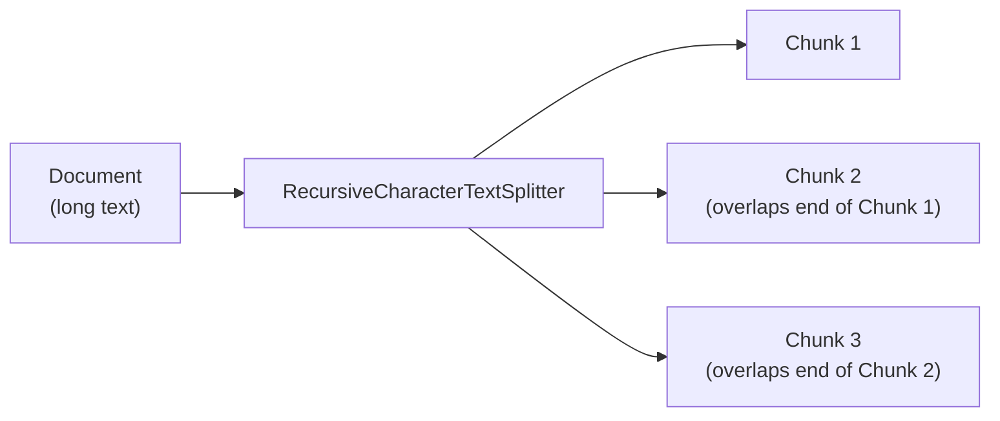

# Text Splitters

Embedding models and context windows both have limits, so a loaded `Document` almost always needs to be broken into smaller pieces — *chunks* — before it can be indexed. Splitting is where retrieval quality is won or lost; get it wrong and no amount of prompt tuning fixes it downstream.

## The default: `RecursiveCharacterTextSplitter`

```python
from langchain_text_splitters import RecursiveCharacterTextSplitter

text_splitter = RecursiveCharacterTextSplitter(
    chunk_size=1000,
    chunk_overlap=200,
    add_start_index=True,
)
all_splits = text_splitter.split_documents(docs)
```

It tries a list of separators in order (`"\n\n"`, `"\n"`, `" "`, `""`), recursively falling back to a finer one only when a chunk is still too big. In practice this keeps paragraphs and sentences intact far more often than a naive fixed-length cut. `add_start_index=True` records each chunk's offset in the source document in `metadata["start_index"]` — useful for citation later.

## Other splitters worth knowing

- **Token-aware splitters** (`chunk_size` measured in model tokens, not characters) — line up chunk boundaries with what actually fills the context window, which character counts only approximate.
- **Language-aware splitters** (`from_language`) — split code by function/class boundary instead of blank lines, for source-code retrieval.
- **Semantic chunking** — splits at points where embedding similarity between adjacent sentences drops, instead of a fixed size; more expensive (an embedding call per boundary candidate) but keeps topically coherent chunks together.



## Chunk size and overlap tradeoffs

| Setting | Smaller / less overlap | Larger / more overlap |
| --- | --- | --- |
| Retrieval precision | Higher — each chunk is narrowly about one thing | Lower — chunks blend multiple topics, diluting the match |
| Context given to the model | Lower — may miss surrounding detail | Higher — more supporting context per retrieved chunk |
| Index size / storage cost | Lower | Higher — overlap duplicates text across chunks |
| Chances of straddling a boundary mid-answer | Higher | Lower |

There's no universal default; 500–1500 characters with 10–20% overlap is a reasonable starting point to tune from against your own retrieval evals.

:::warning[Pitfalls]
A chunk boundary that lands mid-explanation can return a fragment that answers the *wrong* question confidently. And overlap set too high (say, 50%+) roughly doubles index size for a diminishing precision gain — it pads cost more than it fixes boundary issues.
:::

## See also

- [Document Loaders](./document-loaders.md) — chunks are only as good as the `Document` and metadata they're split from.
- [Embeddings](./embeddings.md) — what happens to each chunk next.
