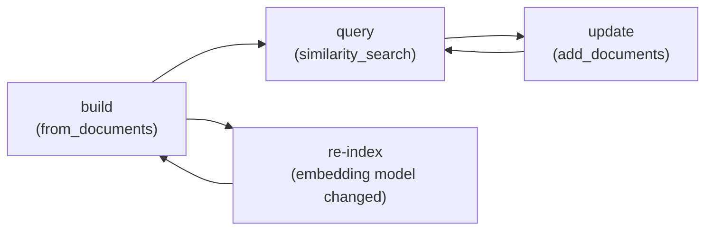

# Vector Store Overview

A vector store persists embedded chunks and answers nearest-neighbour queries. Every implementation in this folder — Chroma, FAISS, pgvector, Pinecone — sits behind the same `VectorStore` interface, so swapping the backend later is mostly a constructor change, not a rewrite.

```python
from langchain_core.documents import Document

documents = [
    Document(page_content="LangChain composes LLM calls into chains.", metadata={"source": "intro"}),
    Document(page_content="A retriever returns the chunks most relevant to a query.", metadata={"source": "intro"}),
]

ids = vector_store.add_documents(documents)
results = vector_store.similarity_search("what does a retriever do?", k=1)
retriever = vector_store.as_retriever(search_type="similarity", search_kwargs={"k": 4})
```

## The shared surface

| Method | Does |
|---|---|
| `from_documents(docs, embedding, ...)` | Build a new store from `Document`s in one call |
| `add_documents(docs)` | Index more chunks into an existing store |
| `similarity_search(query, k)` | Return the `k` nearest chunks to a query |
| `as_retriever(search_type, search_kwargs)` | Wrap the store as a `Retriever` Runnable ([Retrievers](../04-retrieval/retrievers.md)) |

## Index lifecycle



Re-indexing — not updating — is what you do after changing the embedding model or the chunking strategy, since neither is comparable to what's already stored ([Embeddings](../04-retrieval/embeddings.md)).

:::info[Key idea]
The pages that follow differ mainly in **setup and filtering syntax**, not in how you call them. Once you know `similarity_search` and `as_retriever`, moving from Chroma to pgvector is a config change.
:::

## See also

- [Retrievers](../04-retrieval/retrievers.md) — search strategies layered on top of `as_retriever`.
- [Comparison](./comparison.md) — which store to pick for a given workload.
