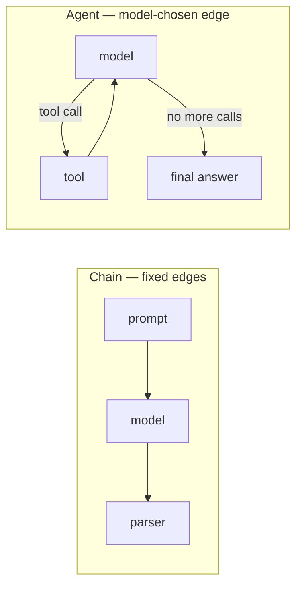

# Agent Concepts

A **chain** has edges you fixed at design time: step A always leads to step B. An **agent** hands that decision to the model — the next step is chosen at runtime, from the model's own output.

| Signal | Use |
|---|---|
| Steps and their order are known ahead of time | a chain (LCEL) |
| The number of steps depends on what a tool returns | an agent |
| The model needs to decide *which* tool, if any | an agent |
| You need a step cap and a hard cost ceiling anyway | an agent, with limits set explicitly |

:::warning
Every agent needs a step cap and a cost cap. A router that never decides to stop runs until the framework's recursion limit or your provider bill stops it — an unbounded loop is a billing incident, not a bug you notice gracefully.
:::

`create_agent` builds the common case: bind tools, loop the model against them, stop when the model answers without requesting another call. It is built on LangGraph under the hood (see [Why LangGraph](../07-langgraph/why-langgraph.md)), which is why step limits, checkpointing, and human-in-the-loop approval all become available once you need them.

## See also

- [Tool Calling](./tool-calling.md) — the manual loop `create_agent` automates.
- [React Agent](./react-agent.md) — a runnable example.
- [Why LangGraph](../07-langgraph/why-langgraph.md) — the orchestration layer agents run on.
