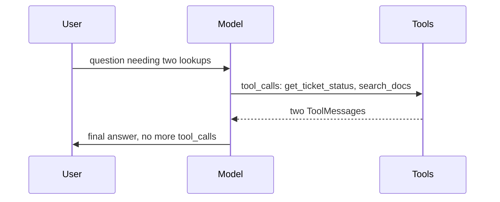

# React Agent

`create_agent` builds a ReAct-style agent — reason, act, observe, repeat — from a model and a tool list. The constructor itself lives in LangGraph's prebuilt layer; `langchain.agents.create_agent` is the stable entry point.

```python
from langchain.agents import create_agent

def search_docs(query: str) -> str:
    """Search internal documentation."""
    return f"Top result for '{query}': see the onboarding guide, page 4."

def get_ticket_status(ticket_id: str) -> str:
    """Look up the status of a support ticket."""
    return f"Ticket {ticket_id}: in progress, assigned to support."

agent = create_agent(
    model="claude-sonnet-4-6",
    tools=[search_docs, get_ticket_status],
    system_prompt="You are a support assistant. Use tools to answer accurately.",
)

result = agent.invoke({
    "messages": [{"role": "user", "content": "What's the status of ticket 4821, and where's the onboarding guide?"}]
})
for msg in result["messages"]:
    print(type(msg).__name__, "-", getattr(msg, "content", msg))
```

Walking one trace through the loop:

1. **Reason** — the model reads the question, decides it needs two tool calls (one per sub-question).
2. **Act** — it emits an `AIMessage` with two `tool_calls`: `get_ticket_status` and `search_docs`.
3. **Observe** — `create_agent` executes both, appends a `ToolMessage` per call.
4. **Reason again** — the model reads both results and decides it has enough to answer.
5. **Act (final)** — it emits an `AIMessage` with no `tool_calls`, just text. The loop stops here.



## See also

- [Agent Concepts](./agent-concepts.md) — chain vs agent, when to reach for this.
- [Custom Tools](./custom-tools.md) — writing `search_docs`-style functions.
- Why LangGraph — the orchestration layer this constructor is built on (LangGraph section, later in this reference).
