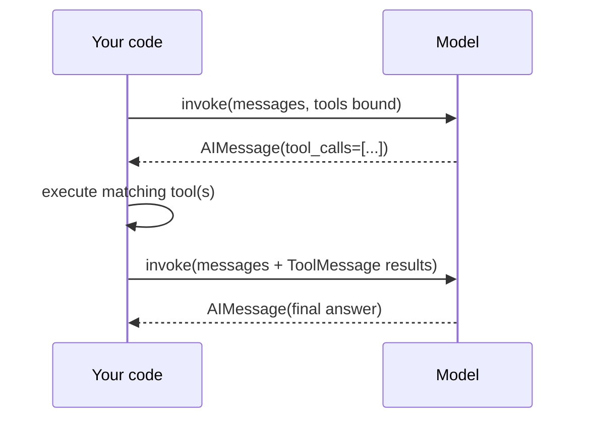

# Tool Calling

:::info[Key idea]
The model never executes anything. It only requests a call — your code decides whether to honour it, runs it, and reports the result back.
:::

A chat model gains access to tools by binding them, then the round trip runs in your code, not inside the model:

```python
from langchain.chat_models import init_chat_model

def get_weather(location: str) -> str:
    """Get the weather at a location."""
    return f"It's sunny in {location}."

model = init_chat_model("claude-sonnet-4-6", model_provider="anthropic")
model_with_tools = model.bind_tools([get_weather])

messages = [{"role": "user", "content": "What's the weather in Lisbon?"}]
ai_msg = model_with_tools.invoke(messages)
messages.append(ai_msg)

for tool_call in ai_msg.tool_calls:
    tool_result = get_weather.invoke(tool_call)
    messages.append(tool_result)

final_response = model_with_tools.invoke(messages)
print(final_response.text)
```

The [`AIMessage`](../02-core-primitives/messages.md) returned by the first `invoke` carries `tool_calls` instead of (or alongside) text — each entry has a `name`, `args`, and `id`. Your code executes the matching tool and appends a `ToolMessage` keyed to that `id`. The second `invoke` gives the model the result so it can produce a final answer.

| Step | Who acts | What happens |
|---|---|---|
| 1 | model | emits `tool_calls` on an `AIMessage` instead of answering directly |
| 2 | your code | matches each call to a tool, executes it |
| 3 | your code | appends a `ToolMessage` per call, `tool_call_id` matching |
| 4 | model | reads the `ToolMessage`s, produces the final response |



This manual loop is what `create_agent` automates: bind, call, execute, append, repeat until the model stops requesting tools. See [Agent Concepts](./agent-concepts.md) for when that automation is worth reaching for.

## See also

- [Messages](../02-core-primitives/messages.md) — the `AIMessage`/`ToolMessage` shapes this loop depends on.
- [Custom Tools](./custom-tools.md) — writing the tools that get bound.
- [Agent Concepts](./agent-concepts.md) — automating this loop instead of hand-rolling it.
