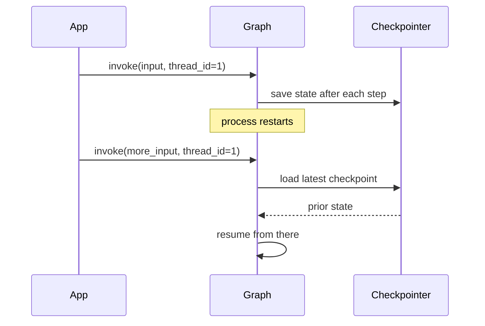

# Checkpointing

A **checkpointer** saves the graph's state after every step, keyed by a `thread_id`. Compile with one and any run becomes resumable — after a crash, a restart, or a deliberate pause for human review.

```python
from langgraph.checkpoint.memory import InMemorySaver

graph = builder.compile(checkpointer=InMemorySaver())

config = {"configurable": {"thread_id": "customer_123"}}
graph.invoke({"messages": [("user", "hi")]}, config)

# later, same thread_id: resumes with full prior state
graph.invoke({"messages": [("user", "and then?")]}, config)
```

| Checkpointer | Storage | Use it when |
|---|---|---|
| `InMemorySaver` | process memory | local development, tests |
| `SqliteSaver` | local SQLite file | single-process durability, prototypes |
| `PostgresSaver` | Postgres | production, multi-process, multi-instance |

A new `thread_id` starts a fresh, empty state; reusing one resumes exactly where that thread left off. Inspect prior states with `graph.get_state_history(config)`.



:::tip
`InMemorySaver` is fine for a demo but disappears with the process. Anything a user expects to persist across a restart needs `SqliteSaver` or `PostgresSaver`.
:::

## See also

- [Human in the Loop](./human-in-the-loop.md) — interrupts depend on a checkpointer.
- Thread Persistence — durable conversations built on this (Memory & State section, later in this reference).
