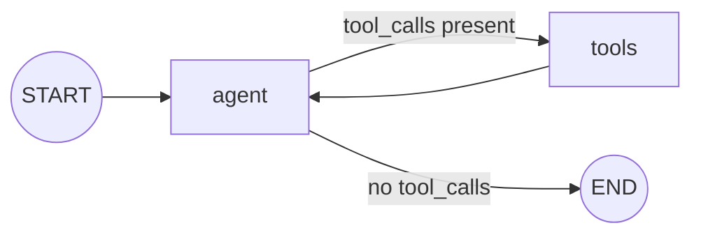

# Conditional Edges

A plain `add_edge("a", "b")` always routes from `a` to `b`. `add_conditional_edges` routes based on a function of the current state — this is how a graph loops an agent node against a tool node until the model stops requesting calls.

```python
from typing import Literal
from langgraph.graph import StateGraph, START, END

def route(state: State) -> Literal["tools", "__end__"]:
    last = state["messages"][-1]
    if getattr(last, "tool_calls", None):
        return "tools"
    return END

builder = StateGraph(State)
builder.add_node("agent", call_model)
builder.add_node("tools", call_tools)
builder.add_edge(START, "agent")
builder.add_conditional_edges("agent", route)
builder.add_edge("tools", "agent")
graph = builder.compile()
```



:::danger
Always set a step cap. `graph.invoke(input, {"recursion_limit": 25})` raises `GraphRecursionError` instead of running forever if the router never returns `END` — a router bug here is a billing incident, not a graceful failure. For a softer stop, track a `RemainingSteps` field in state and route to `END` when it runs low, so the graph returns its current state instead of erroring.
:::

## See also

- [State and Nodes](./state-and-nodes.md) — the state shape a router function reads.
- [Agent Concepts](../06-tools-and-agents/agent-concepts.md) — why an agent needs a step cap and a cost cap.
