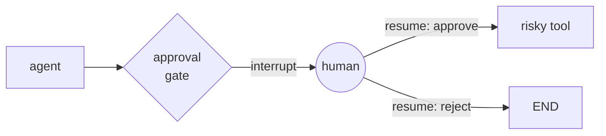

# Human in the Loop

`interrupt()` pauses a graph mid-run, persists its full state via the checkpointer, and waits — no polling, no separate queue. A `Command(resume=...)` call later continues execution from that exact point with the human's input folded in.

```python
from langgraph.checkpoint.memory import InMemorySaver
from langgraph.graph import END, START, StateGraph
from langgraph.types import Command, interrupt

def human_review(state: State):
    decision = interrupt({"proposed_action": state["action"]})
    return {"approved": decision["approved"]}

graph = (
    StateGraph(State)
    .add_node("human_review", human_review)
    .add_edge(START, "human_review")
    .add_edge("human_review", END)
    .compile(checkpointer=InMemorySaver())
)

config = {"configurable": {"thread_id": "run-1"}}
graph.invoke({"action": "delete_record"}, config)  # pauses at human_review

# ... a human reviews, then:
graph.invoke(Command(resume={"approved": True}), config)  # resumes
```



:::tip
Gate on the tool's blast radius, not on the model's confidence. A confident model can still be confidently wrong — what matters is whether the action it's about to take (delete, send, spend) can be undone.
:::

Requires a checkpointer — see [Checkpointing](./checkpointing.md) — since the whole point is pausing execution and resuming it later, possibly in a different process.

## See also

- [Checkpointing](./checkpointing.md) — the persistence layer interrupts depend on.
- [Multi-Tool Routing](../06-tools-and-agents/multi-tool-routing.md) — gating destructive tool calls.
