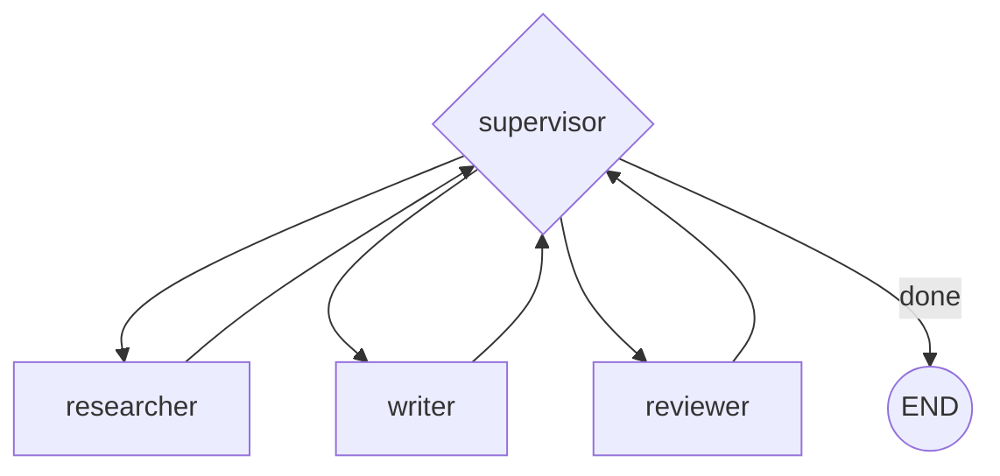

# Multi-Agent Patterns

A single agent with more tools is usually simpler and cheaper than several agents talking to each other. Multi-agent earns its complexity when one model juggling every tool starts picking the wrong one, or when responsibilities are cleanly separable (a researcher, a writer, a reviewer) and keeping their contexts and system prompts separate improves each one's accuracy.

The common shape is a **supervisor**: a node that inspects the state and routes to a specialist agent, which does its work and either returns to the supervisor or, in a subgraph, hands off directly to another agent with `Command(goto=..., graph=Command.PARENT)`.

```python
from typing import Literal
from langgraph.types import Command

def supervisor(state: State) -> Command[Literal["researcher", "writer", "__end__"]]:
    next_agent = decide_next(state)  # your routing logic
    return Command(goto=next_agent)

def researcher(state: State) -> Command[Literal["supervisor"]]:
    findings = do_research(state["task"])
    return Command(update={"findings": findings}, goto="supervisor")
```



| Pattern | Who decides the next agent | State sharing |
|---|---|---|
| Supervisor | a dedicated router node | shared state, supervisor sees everything |
| Direct handoff | the agent itself, via `Command(goto=...)` | can be shared or scoped per subgraph |

:::warning[Pitfalls]
Multi-agent multiplies token cost — every hop re-serializes context — and multiplies failure surface, since now a routing bug *and* each agent's own logic can go wrong. A single agent with a better system prompt and a tighter tool list is usually the right first answer; reach for multi-agent only after that concretely fails.
:::

## See also

- [Conditional Edges](./conditional-edges.md) — the routing mechanism a supervisor is built from.
- [Why LangGraph](./why-langgraph.md) — where the cyclic-graph model this depends on is introduced.
