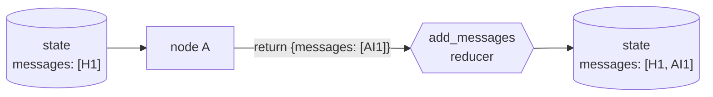

# State and Nodes

A `StateGraph` is built around a state schema — usually a `TypedDict` — and a set of nodes, each a plain function that receives the current state and returns a **partial update**, not the whole state.

```python
from typing import Annotated
from typing_extensions import TypedDict
from langgraph.graph import StateGraph, START, END
from langgraph.graph.message import add_messages
from langchain.messages import AnyMessage

class State(TypedDict):
    messages: Annotated[list[AnyMessage], add_messages]
    step_count: int

def call_model(state: State):
    # returns only the keys it changes
    return {"messages": [...], "step_count": state["step_count"] + 1}

builder = StateGraph(State)
builder.add_node("call_model", call_model)
builder.add_edge(START, "call_model")
builder.add_edge("call_model", END)
graph = builder.compile()
```

Each key in the state can declare a **reducer** — a merge function applied when a node returns a value for that key. Without one, a new value overwrites the old. `add_messages`, LangGraph's built-in reducer for message lists, appends instead of replacing, and also normalizes plain dicts/tuples into message objects.



| Key shape | Reducer | Effect |
|---|---|---|
| `Annotated[list[AnyMessage], add_messages]` | `add_messages` | appends new messages, normalizes format |
| `Annotated[list, operator.add]` | `operator.add` | concatenates lists |
| plain field, no `Annotated` | none (default) | last write wins |

:::warning[Pitfalls]
Returning the *entire* state from a node instead of the changed keys silently re-triggers every reducer on every field, not just the one you meant to update. And a list-typed key with no reducer gets overwritten on every node call instead of accumulating — a common cause of a chat history that mysteriously resets each turn.
:::

## See also

- [Why LangGraph](./why-langgraph.md) — when a graph replaces a chain.
- [Conditional Edges](./conditional-edges.md) — routing between nodes based on state.
- [Messages](../02-core-primitives/messages.md) — the message types flowing through `messages`.
