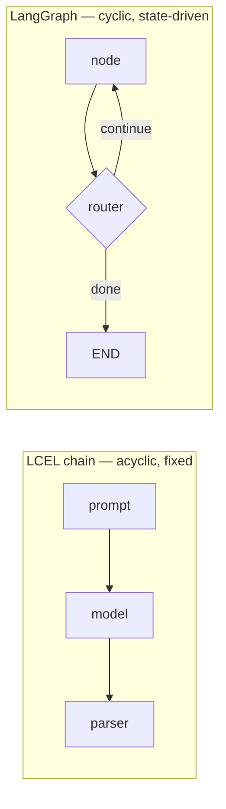

# Why LangGraph

An [LCEL chain](../02-core-primitives/runnables-and-lcel.md) is a DAG you drew at design time — data flows forward through a fixed sequence of steps and stops. That model breaks down the moment an application needs a **loop** (retry until a check passes), a **branch chosen at runtime** (the model decides which tool, if any), or a **pause** (wait for a human before continuing). LangGraph is the orchestration layer built for exactly that: a graph of nodes and edges, with a state object that flows between them and can cycle back on itself.

:::info[Key idea]
LangGraph doesn't replace LCEL — a graph node is often just a compiled LCEL chain. LangGraph adds the loop, the branch, and the durable state around chains that individually stay linear.
:::

`create_agent` (see [Agent Concepts](../06-tools-and-agents/agent-concepts.md)) is itself a thin, pre-built LangGraph graph. This section covers what you build once the pre-built agent isn't shaped like your problem: custom state, custom routing, checkpointed persistence, and multi-agent handoff.

## See also

- [Agent Concepts](../06-tools-and-agents/agent-concepts.md) — the chain-vs-agent decision this section builds on.
- [State and Nodes](./state-and-nodes.md) — the core `StateGraph` building blocks.
