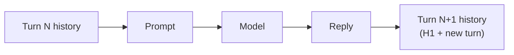

# Chat History

There is no server-side "memory" object that magically remembers a user. **Memory is just the message list you re-send on every call.** Each turn, you append the new human message, invoke the model, append its reply, and send the whole (possibly trimmed) list back next time.

```python
from langchain.chat_models import init_chat_model

model = init_chat_model("anthropic:claude-sonnet-4-6")

history = [{"role": "user", "content": "My name is Ana"}]
response = model.invoke(history)
history.append({"role": "assistant", "content": response.text()})

history.append({"role": "user", "content": "What's my name?"})
response = model.invoke(history)  # sees the whole list, answers "Ana"
```

:::info[Key idea]
"Memory" in an LLM app is application state you own, not a feature the model has. If you don't resend a fact, the model doesn't know it.
:::

## Keying sessions

A real app has many concurrent conversations, so history needs a key — a `thread_id` or `session_id` — to look up the right list. In a `create_agent` + checkpointer setup, that key is the `thread_id` in `config["configurable"]`, and the checkpointer stores the message list on your behalf:

```python
from langchain.agents import create_agent
from langgraph.checkpoint.memory import InMemorySaver

agent = create_agent(
    model="anthropic:claude-sonnet-4-6",
    tools=[],
    checkpointer=InMemorySaver(),
)

config = {"configurable": {"thread_id": "user_42"}}
agent.invoke({"messages": [{"role": "user", "content": "My name is Ana"}]}, config)
agent.invoke({"messages": [{"role": "user", "content": "What's my name?"}]}, config)
```

Reusing `thread_id` "user_42" resumes that thread's history; a new `thread_id` starts empty. See [Checkpointing](../07-langgraph/checkpointing.md) for how the checkpointer itself persists that state.

## Wiring history into a prompt

For a plain LCEL chain (no agent, no checkpointer), thread the history in yourself with `MessagesPlaceholder` — see [Prompt Templates](../02-core-primitives/prompt-templates.md#conversation-history-messagesplaceholder):

```python
from langchain_core.prompts import ChatPromptTemplate, MessagesPlaceholder

prompt = ChatPromptTemplate.from_messages([
    ("system", "You are a helpful assistant."),
    MessagesPlaceholder("history"),
    ("human", "{question}"),
])
```



:::warning[Pitfalls]
Most tutorials online still show `ConversationBufferMemory` and `ConversationChain` — both deprecated in LangChain 1.x (see [Versions and Migration](../00-overview/versions-and-migration.md)). The current approach is either a checkpointer-backed agent (above) or explicit `MessagesPlaceholder` wiring — not a `Memory` class.
:::

## See also

- [Trimming and Summarization](./trimming-and-summarization.md) — history grows without bound unless you manage it.
- [Checkpointing](../07-langgraph/checkpointing.md) — how `thread_id` state is actually stored.
