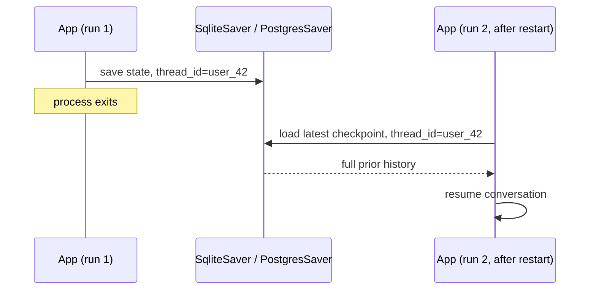

# Thread Persistence

[Checkpointing](../07-langgraph/checkpointing.md) covers *how* a checkpointer saves state. This page covers the specific case of a conversation surviving a process restart — the thing users actually expect from "the app remembers me."

LangGraph splits persistence into two systems:

- **Checkpointers** — short-term, thread-scoped state: the message history and any other state for one `thread_id`. This is what makes a conversation resumable.
- **Stores** — long-term, cross-thread state: facts that should outlive and span threads, like a user's stated preferences.

This page is about checkpointers; cross-thread `Store` usage is a separate concern beyond this section's scope.

## Surviving a restart

Swap `InMemorySaver` for a durable backend and the same `thread_id` keeps working after the process comes back up:

```python
from langchain.agents import create_agent
from langgraph.checkpoint.sqlite import SqliteSaver

with SqliteSaver.from_conn_string("chat_history.db") as checkpointer:
    agent = create_agent(
        model="anthropic:claude-sonnet-4-6",
        tools=[],
        checkpointer=checkpointer,
    )

    config = {"configurable": {"thread_id": "user_42"}}
    agent.invoke(
        {"messages": [{"role": "user", "content": "My name is Ana"}]},
        config,
    )
# process restarts here — SqliteSaver's file on disk survives it
```

On the next process start, opening the same `chat_history.db` with the same `thread_id` resumes with full prior state — no application code needs to reload or replay the conversation manually.



`SqliteSaver` covers a single-process deployment; `PostgresSaver` is the production choice for multi-process or multi-instance deployments where more than one process needs to read/write the same threads.

:::danger
A conversation store holds real user data — names, questions, anything said in the chat. Retention limits and a deletion path (a user asking to be forgotten) are a privacy requirement, not an optional feature. Decide the retention policy before you pick the storage backend, not after.
:::

## See also

- [Checkpointing](../07-langgraph/checkpointing.md) — the checkpointer mechanics this builds on.
- [Trimming and Summarization](./trimming-and-summarization.md) — a persisted history still needs a token budget on each call.
