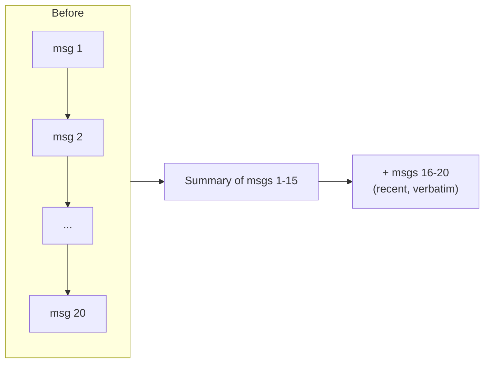

# Trimming and Summarization

An unbounded chat history eventually exceeds the model's context window, and even before that, it inflates every call's token cost and latency. Two standard strategies keep it in check.

## Trim by token count

`trim_messages` cuts a message list down to a token budget, using an approximate or exact counter:

```python
from langchain_core.messages.utils import trim_messages, count_tokens_approximately
from langchain.chat_models import init_chat_model
from langgraph.graph import StateGraph, START, MessagesState

model = init_chat_model("anthropic:claude-sonnet-4-6")

def call_model(state: MessagesState):
    messages = trim_messages(
        state["messages"],
        strategy="last",
        token_counter=count_tokens_approximately,
        max_tokens=128,
        start_on="human",
        end_on=("human", "tool"),
    )
    response = model.invoke(messages)
    return {"messages": [response]}
```

`strategy="last"` keeps the most recent messages; `start_on`/`end_on` avoid cutting mid-exchange (e.g. leaving a dangling `ToolMessage` with no matching call). This runs inside a LangGraph node so it applies fresh on every turn — the checkpointer still stores the *full* history, only the trimmed view goes to the model.

## Rolling summarization

Trimming discards old turns outright; summarization compresses them into a short synopsis first, so the model keeps the gist without the token cost:



Run a cheap/fast model over the older slice, replace it with a `SystemMessage` summary, and keep the last few turns verbatim. This costs an extra LLM call per compaction but scales to much longer conversations than trimming alone.

| Strategy | Preserves | Loses | Cost |
|---|---|---|---|
| Trim (last-N) | recent exchange, exact wording | everything before the cutoff | free (no extra call) |
| Rolling summary | gist of the whole conversation | verbatim old wording, fine detail | one summarization call per compaction |

:::tip
Start with trimming — it's free and covers most chat UIs. Reach for summarization only when users genuinely reference facts from many turns back (support threads, long-running agents).
:::

## See also

- [Chat History](./chat-history.md) — the message list this operates on.
- [Async and Batching](../03-composition/async-and-batching.md) — `count_tokens_approximately` vs an exact provider tokenizer is the same speed/accuracy tradeoff.
