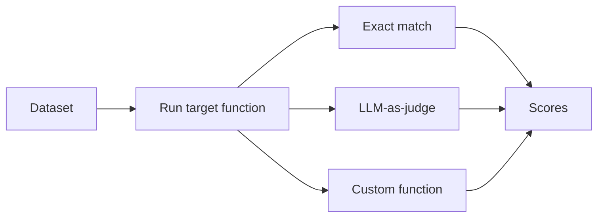

# Datasets & Evals

A trace tells you one run went wrong. A dataset lets you check whether a prompt or model change made things *better or worse* across many runs at once — the LLM equivalent of a regression test suite.

## Building a dataset

Pull real cases from traces rather than inventing synthetic ones — actual user questions and actual retrieved documents surface the failure modes production will hit.

```python
from langsmith import Client

client = Client()

dataset = client.create_dataset(dataset_name="support-bot-eval")
client.create_examples(
    dataset_id=dataset.id,
    examples=[
        {
            "inputs": {"question": "How do I reset my password?"},
            "outputs": {"answer": "Go to Settings > Security > Reset password."},
        },
        {
            "inputs": {"question": "Can I get a refund on my last order?"},
            "outputs": {"answer": "Refunds require the order ID and are processed within 5 business days."},
        },
    ],
)
```

## Evaluator types



| Type | How it scores | Use it when |
|---|---|---|
| Exact / heuristic match | string/JSON equality, regex | output has one correct shape (classification, extraction) |
| LLM-as-judge | a model scores correctness/groundedness against a rubric | free-form answers where exact match is too strict |
| Custom function | your own Python, e.g. checking a trajectory of tool calls | agent behavior, multi-step correctness |

```python
def correct(inputs: dict, outputs: dict, reference_outputs: dict) -> bool:
    return outputs["answer"] == reference_outputs["answer"]

results = client.evaluate(
    my_app,
    data="support-bot-eval",
    evaluators=[correct],
    experiment_prefix="gpt-baseline",
)
```

Run this after every prompt or model change and diff the scores against the previous experiment — that comparison is the regression gate.

:::tip
Twenty real examples beat two hundred synthetic ones. A small dataset built from actual traces catches the failure modes that matter; a large synthetic one mostly tests cases nobody will ever send.
:::
