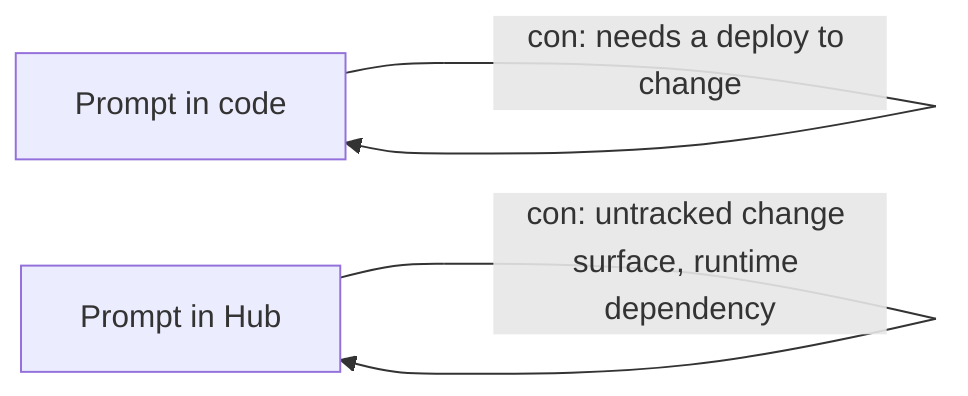

# Prompt Hub

The Prompt Hub stores prompts outside your codebase, versioned by commit hash, and lets you pull the current (or a pinned) version at runtime.

```python
from langchain_classic import hub as prompts
from langchain.chat_models import init_chat_model

prompt = prompts.pull("my-org/support-triage")
model = init_chat_model("gpt-4o-mini", model_provider="openai")
chain = prompt | model
chain.invoke({"question": "Where is my order?"})
```

Pin a specific version by appending its commit hash:

```python
prompt = prompts.pull("my-org/support-triage:12344e88")
```

Pushing a new version from code:

```python
from langsmith import Client
from langchain_core.prompts import ChatPromptTemplate

client = Client()
prompt = ChatPromptTemplate.from_messages([
    ("system", "You triage support tickets into: billing, technical, account."),
    ("human", "{ticket}"),
])
client.push_prompt("my-org/support-triage", object=prompt)
```

## The tradeoff



Pulling from the Hub trades a deploy cycle for a live, editable prompt — useful for teams iterating on wording without engineering in the loop. It also means the prompt can change out from under you between deploys.

:::warning
Pin a version (`name:commit_hash`) in production. Pulling `"latest"` (the unpinned name) means an unreviewed edit made in the Hub UI ships itself the next time your service restarts.
:::
