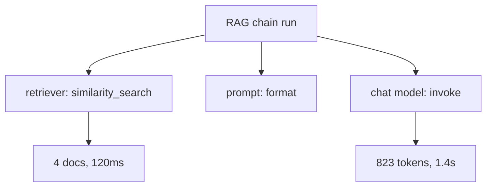

# Tracing

LangSmith tracing records every step a LangChain/LangGraph run takes — each model call, tool call, and retriever lookup — as a nested tree you can inspect after the fact. It's the fastest way to find *which* step in a multi-step chain produced a bad answer.

## Turning it on

Set these environment variables (loaded the same way as the provider keys in [Keys & Config](../01-setup/keys-and-config.md)):

```bash title=".env"
LANGSMITH_TRACING=true
LANGSMITH_API_KEY=lsv2_pt_...
LANGSMITH_PROJECT=my-project
```

No code changes required — any `Runnable.invoke`/`stream`/`batch` call, and any LangGraph node, gets traced automatically once these are set. Traces appear in the LangSmith UI under the named project.

## What a trace contains

Each run in the tree records:

| Field | What it shows |
|---|---|
| Inputs / outputs | the exact payload each step received and returned |
| Latency | wall-clock time for that step alone |
| Token usage | prompt/completion tokens per LLM call, rolled up per run |
| Errors | exceptions raised, with the step that raised them |
| Metadata/tags | anything you attached via `RunnableConfig` (see [Config & Fallbacks](../03-composition/config-and-fallbacks.md)) |



Reading a trace top-down tells you which span is slow, which span errored, and — critically for RAG — exactly which documents the retriever handed the model, so you can tell a retrieval failure from a generation failure at a glance.

:::danger
Traces capture prompts and outputs — that is user data leaving your process and landing in LangSmith's storage. Know what you are sending before enabling tracing on production traffic; mask or redact fields (`LANGSMITH_HIDE_INPUTS`, `LANGSMITH_HIDE_OUTPUTS`) if payloads carry PII.
:::

:::tip
Tag a trace with `RunnableConfig(tags=[...], metadata={...})` at call time so you can filter the UI by user, request type, or experiment without changing the chain itself.
:::
