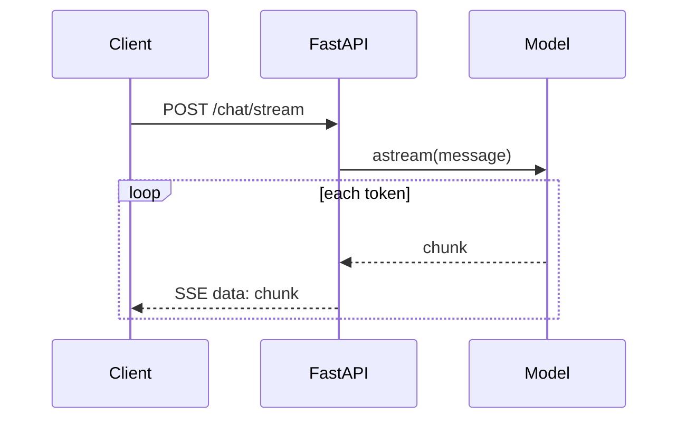

# FastAPI Patterns

Hand-rolling a FastAPI app around a chain or graph gives you control LangServe doesn't: custom auth, arbitrary request/response shapes, and full ownership of streaming.

## Lifespan-scoped clients

Build the model, vector store, and any provider clients once at startup, not per request. Constructing a client per request re-does connection setup and (for some providers) auth handshakes on every call.

```python
from contextlib import asynccontextmanager
from fastapi import FastAPI
from langchain.chat_models import init_chat_model

@asynccontextmanager
async def lifespan(app: FastAPI):
    app.state.model = init_chat_model("gpt-4o-mini", model_provider="openai")
    yield

app = FastAPI(lifespan=lifespan)

@app.post("/chat")
async def chat(message: str):
    response = await app.state.model.ainvoke(message)
    return {"content": response.content}
```

## Streaming responses (SSE)

Use `StreamingResponse` with `astream` or `astream_events` to push tokens to the client as they arrive instead of buffering the full response.

```python
from fastapi.responses import StreamingResponse

@app.post("/chat/stream")
async def chat_stream(message: str):
    async def event_stream():
        async for chunk in app.state.model.astream(message):
            yield f"data: {chunk.content}\n\n"
    return StreamingResponse(event_stream(), media_type="text/event-stream")
```



## Background work for long runs

An agent loop or a multi-step graph can run past a reasonable HTTP timeout. Kick it off as a background task (or a job queue for anything longer than a few seconds) and let the client poll or reconnect via a `thread_id`, rather than holding the connection open for the whole run.

:::warning[Pitfalls]
Two mistakes show up constantly in hand-rolled serving code:

- **A model or vector-store client constructed inside the request handler** instead of at lifespan scope — every request pays setup cost that should happen once.
- **A sync, blocking call (`model.invoke`, a sync DB driver) inside an `async def` route** — it blocks the event loop for every other concurrent request on that worker, not just the one that made the call. Use the async variant (`ainvoke`, `abatch`) or run the sync call in a thread pool via `run_in_threadpool`.
:::

## See also

- [LangServe](./langserve.md) — the framework-provided alternative when you don't need custom routes.
- [Streaming](../03-composition/streaming.md) — which chain steps can actually stream.
