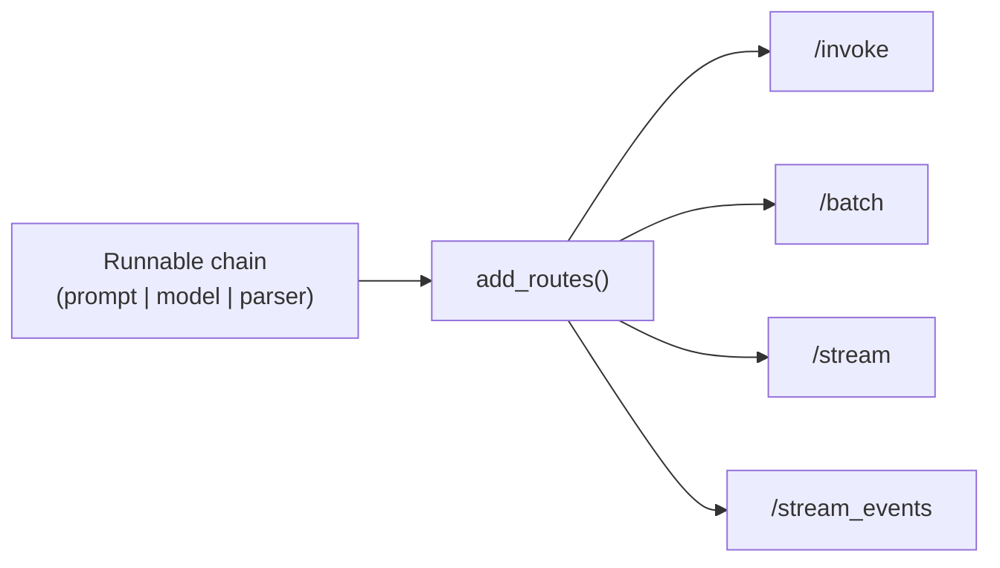

# LangServe

`langserve` wraps a [Runnable](../02-core-primitives/runnables-and-lcel.md) in a FastAPI app and gives you `/invoke`, `/batch`, `/stream`, and `/stream_events` endpoints, plus request/response schemas derived from the chain's input/output types — for free, with no route code of your own.

```python
from fastapi import FastAPI
from langserve import add_routes
from langchain.chat_models import init_chat_model
from langchain_core.prompts import ChatPromptTemplate
from langchain_core.output_parsers import StrOutputParser

app = FastAPI(title="LangChain Server", version="1.0")

model = init_chat_model("gpt-4o-mini", model_provider="openai")
prompt = ChatPromptTemplate.from_template("Translate to French: {text}")
chain = prompt | model | StrOutputParser()

add_routes(app, chain, path="/translate")

# uvicorn main:app --reload
# POST http://localhost:8000/translate/invoke  {"input": {"text": "hello"}}
```



:::info[Key idea]
`add_routes` reads the chain's `input_schema`/`output_schema` off the Runnable itself, so the HTTP contract stays in sync with the chain automatically — change the prompt's input variables and the generated schema changes with it.
:::

## Where it stands

LangServe was built for the LCEL era, when a chain was mostly linear. It has not kept pace with LangGraph-based agents — streaming a graph's intermediate steps, human-in-the-loop interrupts, and multi-turn thread state fit awkwardly into its request/response model. For new agent work, prefer:

- **LangGraph Platform / LangSmith Deployments** — purpose-built for serving graphs, with built-in persistence, streaming, and human-in-the-loop support (`langgraph deploy`).
- **Plain FastAPI** (see [FastAPI Patterns](./fastapi-patterns.md)) — full control when you need custom auth, rate limiting, or a request shape LangServe doesn't model well.

LangServe is still a reasonable fit for a single, mostly-linear LCEL chain that doesn't need graph features.

:::warning[Pitfalls]
Don't build new agent deployments on LangServe expecting first-class support for interrupts or checkpointed threads — those are LangGraph Platform concerns. LangServe's sweet spot is a stateless or lightly-stateful chain.
:::

## See also

- [Streaming](../03-composition/streaming.md) — what `/stream` and `/stream_events` actually expose.
- [Why LangGraph](../07-langgraph/why-langgraph.md) — when a chain becomes a graph.
