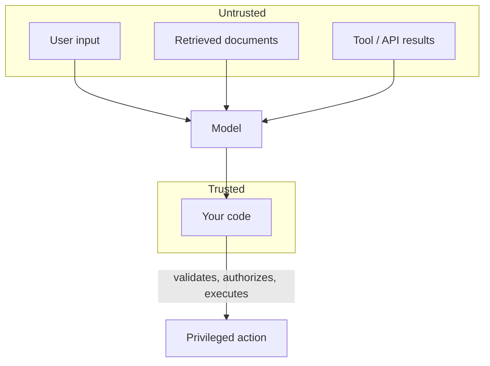

# Security

An LLM app has trust boundaries that don't exist in a normal backend: text the model reads can also *steer* the model. Anything that isn't your own code is untrusted input.

## Prompt injection

A retrieved document or a tool's response can contain text crafted to look like an instruction ("ignore previous instructions and...") — the model can't reliably distinguish data from instructions embedded in that data. This is why [multi-tool routing](../06-tools-and-agents/multi-tool-routing.md) treats tool output as untrusted: a search result or a scraped page is exactly as capable of injecting instructions as raw user input.

## Tool sandboxing and least privilege

The mitigation isn't a better prompt — it's a permission boundary the model cannot talk its way past:

- A SQL agent connects with a read-only database role, not the app's full-access credentials.
- A shell or code-execution tool runs in a sandboxed process with no access to secrets or the host filesystem.
- A file-write tool is scoped to a specific directory, never an arbitrary path the model supplies.

| Risk | Mitigation |
|---|---|
| Prompt injection via retrieved content or tool output | Treat all non-code text as untrusted; never let it alone authorize a privileged action |
| Overprivileged tool credentials | Least-privilege service accounts (read-only DB role, scoped API keys) |
| Destructive action from a hallucinated or manipulated tool call | Human approval gate before irreversible operations, see [Human in the Loop](../07-langgraph/human-in-the-loop.md) |
| Secrets leaking into prompts or traces | Never interpolate a key into a prompt; scrub before logging |
| PII in vector stores or trace payloads | Redact or avoid storing PII at ingestion time; apply retention limits |

## Secrets

Never place an API key, connection string, or token inside a prompt — anything in the prompt can end up in a trace, a log, or (in the worst case) the model's own output. Load secrets from environment variables ([Keys and Config](../01-setup/keys-and-config.md)) and keep them out of both the LLM's context and any tracing payload you don't control.

## PII

Vector stores and trace stores both accumulate user data over time. A retriever indexing raw support tickets or a LangSmith project tracing production traffic is now a store of PII subject to the same retention and deletion obligations as any other user-data store — see [Thread Persistence](../08-memory/thread-persistence.md) and [Tracing](../09-langsmith/tracing.md).

:::danger
Treat every model output that reaches `exec`, a shell, a database write, or an outbound HTTP call as hostile input. The model's job is to *suggest* the action; your code's job is to validate and authorize it before it runs. A prompt that says "never do X" is guidance, not enforcement — enforcement has to live in code, not in the prompt.
:::

## See also

- [Multi-Tool Routing](../06-tools-and-agents/multi-tool-routing.md) — why tool results are untrusted input.
- [Keys and Config](../01-setup/keys-and-config.md) — where secrets belong.
