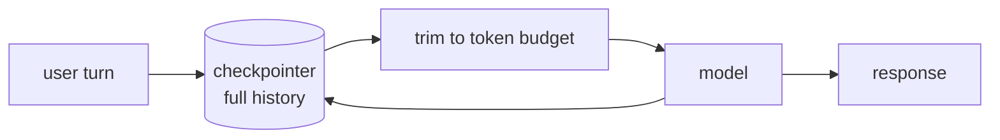

# Chatbot with Memory

A LangGraph agent that remembers a conversation across turns and processes, with a token budget so it doesn't grow unbounded — [thread persistence](../08-memory/thread-persistence.md) and [trimming](../08-memory/trimming-and-summarization.md) applied together rather than explained again here.

```python
from langchain.agents import create_agent
from langchain_core.messages.utils import trim_messages, count_tokens_approximately
from langgraph.checkpoint.sqlite import SqliteSaver

def search_faq(query: str) -> str:
    """Search the product FAQ."""
    return f"FAQ result for '{query}': see docs.example.com/faq"

with SqliteSaver.from_conn_string("chat_history.db") as checkpointer:
    agent = create_agent(
        model="anthropic:claude-sonnet-4-6",
        tools=[search_faq],
        checkpointer=checkpointer,
        pre_model_hook=lambda state: {
            "llm_input_messages": trim_messages(
                state["messages"],
                strategy="last",
                token_counter=count_tokens_approximately,
                max_tokens=2000,
                start_on="human",
                end_on=("human", "tool"),
            )
        },
    )

    config = {"configurable": {"thread_id": "user_42"}}

    agent.invoke(
        {"messages": [{"role": "user", "content": "Hi, I'm Ana."}]},
        config,
    )
    agent.invoke(
        {"messages": [{"role": "user", "content": "What's my name?"}]},
        config,
    )  # -> "Your name is Ana." — resumed from the same thread_id
```



Two thread `id`s per user (one per conversation) keep separate chats from bleeding into each other; a `pre_model_hook` runs the trim on every turn without touching what the checkpointer actually stores, so the full history is still there if you need to inspect or export it later.

## See also

- [Thread Persistence](../08-memory/thread-persistence.md) — the checkpointer mechanics behind `thread_id`.
- [Trimming and Summarization](../08-memory/trimming-and-summarization.md) — the `trim_messages` call used here.
- [React Agent](../06-tools-and-agents/react-agent.md) — the base `create_agent` pattern this extends.
