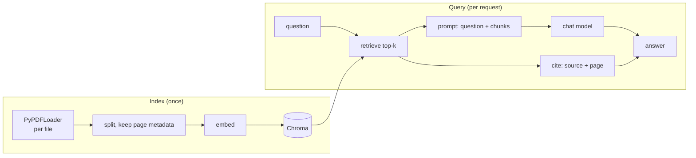

# RAG over PDFs

A citation-aware version of [the RAG pipeline](../04-retrieval/rag-pipeline.md): load a folder of PDFs, chunk them while keeping page numbers, embed into Chroma, and answer with a reference back to the source page.



The citation path (highlighted above as `R --> C --> A`) is the only thing this recipe adds over the base pipeline — it survives the chunking step because [document loaders](../04-retrieval/document-loaders.md) put `page` in `metadata`, and [text splitters](../04-retrieval/text-splitters.md) preserve a parent document's metadata on every chunk they produce.

```python
from pathlib import Path

from langchain.chat_models import init_chat_model
from langchain_chroma import Chroma
from langchain_community.document_loaders import PyPDFLoader
from langchain_core.prompts import ChatPromptTemplate
from langchain_core.runnables import RunnablePassthrough
from langchain_openai import OpenAIEmbeddings
from langchain_text_splitters import RecursiveCharacterTextSplitter

# --- index ---
docs = []
for pdf_path in Path("./reports").glob("*.pdf"):
    docs.extend(PyPDFLoader(str(pdf_path)).load())  # one Document per page, metadata["page"] set

splitter = RecursiveCharacterTextSplitter(chunk_size=1000, chunk_overlap=200)
chunks = splitter.split_documents(docs)

vector_store = Chroma.from_documents(
    chunks,
    embedding=OpenAIEmbeddings(model="text-embedding-3-small"),
    persist_directory="./chroma_pdfs",
)

# --- query ---
retriever = vector_store.as_retriever(search_kwargs={"k": 4})
model = init_chat_model("gpt-4o-mini", model_provider="openai")

prompt = ChatPromptTemplate.from_messages([
    ("system", "Answer using only the provided context. Cite each fact as (source, page)."),
    ("human", "Context:\n{context}\n\nQuestion: {question}"),
])


def format_with_citations(docs: list) -> str:
    return "\n\n".join(
        f"[{d.metadata['source']}, p.{d.metadata['page']}]\n{d.page_content}"
        for d in docs
    )


rag_chain = (
    {"context": retriever | format_with_citations, "question": RunnablePassthrough()}
    | prompt
    | model
)

rag_chain.invoke("What was the reported revenue in Q3?")
```

:::tip
`format_with_citations` puts the source and page number *inside* the context the model reads, not just in a side channel — that's what makes it possible for the model to reproduce a citation in its answer rather than you having to stitch one on afterward.
:::

## See also

- [RAG Pipeline](../04-retrieval/rag-pipeline.md) — the base flow this recipe specializes.
- [Document Loaders](../04-retrieval/document-loaders.md) — why `metadata["page"]` exists in the first place.
- [Chroma](../05-vector-stores/chroma.md) — the vector store used here.
