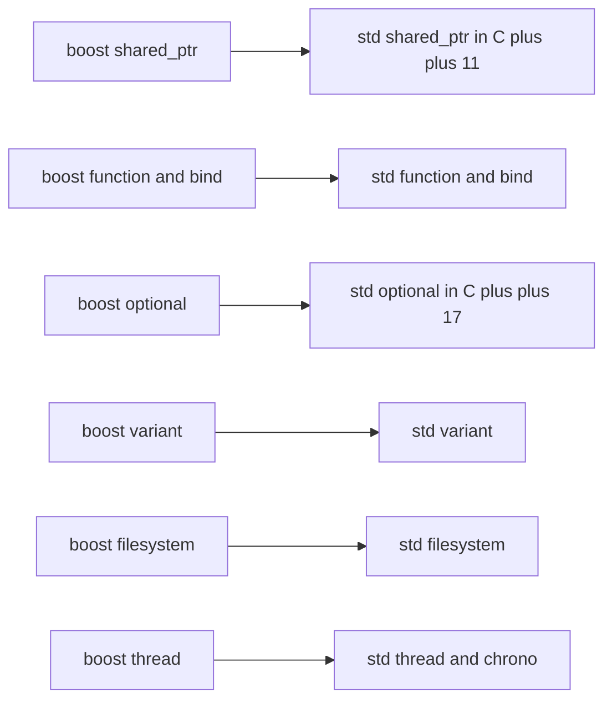

# Boost and the C++ Standard

If `boost::shared_ptr` and `std::shared_ptr` look almost identical, that is because one is the ancestor
of the other. Boost has been the C++ standard library's primary incubator for two decades: ideas are
built and battle-tested in Boost, then proposed to the ISO committee, and the best of them graduate into
`std`. Understanding this lineage is the key to a practical question every modern C++ developer faces —
*should I use `boost::X` or `std::X`?*

:::info Why this matters
Many Boost libraries now have a standard-library twin. On a current toolchain the `std::` version is
usually the right default: no extra dependency, no link step, and it is guaranteed to be there. Reach for
the Boost version when you need a feature `std` lacks, an older compiler forces your hand, or Boost simply
offers more.
:::

## The lineage from Boost to std

Boost components have flowed into the standard in three big waves, plus a steady trickle.

- **C++11** absorbed the smart-pointer and concurrency groundwork: `shared_ptr`, `weak_ptr`, `thread`,
  `mutex`, `bind`, `function`, `array`, `tuple`, `regex`, `chrono`, the `<random>` engines, and much of
  `<type_traits>`.
- **C++17** absorbed the vocabulary types and filesystem: `optional`, `variant`, `any`, and
  `std::filesystem`.
- **Beyond** that, individual pieces continue to migrate, and proposals routinely cite Boost experience as
  evidence that a design works in the field.

This is the same pipeline described in [history and philosophy](./history-and-philosophy.md): build in
Boost, prove it in real projects, then standardise.



## A comparison table

| Boost component | Standard equivalent | First standardised | Notes on the migration |
|-----------------|---------------------|--------------------|------------------------|
| `boost::shared_ptr` / `weak_ptr` | `std::shared_ptr` / `weak_ptr` | C++11 | Near-identical; Boost adds `intrusive_ptr` and more. |
| `boost::scoped_ptr` | `std::unique_ptr` | C++11 | `unique_ptr` is strictly more capable (movable). |
| `boost::function` | `std::function` | C++11 | Same idea; interfaces line up closely. |
| `boost::bind` | `std::bind` / lambdas | C++11 | Prefer lambdas in new code. |
| `boost::array` | `std::array` | C++11 | Direct adoption. |
| `boost::tuple` | `std::tuple` | C++11 | `std` adds structured bindings support. |
| `boost::regex` | `std::regex` | C++11 | Boost.Regex is often faster and more featureful. |
| `boost::chrono` | `std::chrono` | C++11 | `std::chrono` greatly expanded in C++20. |
| `boost::random` | `<random>` | C++11 | Designs are closely related. |
| `boost::optional` | `std::optional` | C++17 | Boost allows `optional<T&>`; `std` does not. |
| `boost::variant` | `std::variant` | C++17 | Different empty/exception semantics (see below). |
| `boost::any` | `std::any` | C++17 | Near drop-in. |
| `boost::filesystem` | `std::filesystem` | C++17 | `std` version derived almost directly from Boost. |
| `boost::thread` | `std::thread` | C++11 | Boost adds interruption, thread groups, more. |
| `boost::unordered_map` | `std::unordered_map` | C++11 | Boost added open-addressing variants later. |

## How to choose today

A practical decision procedure:

1. **Does a `std::` equivalent exist and does your toolchain support it?** If yes, default to `std::`.
   You avoid a dependency, avoid a possible [link step](./header-only-vs-compiled.md), and get something
   guaranteed present.
2. **Are you stuck on an older standard or compiler?** If you must target C++14 but want `optional`, or a
   platform whose `std::filesystem` is incomplete, the Boost version backfills the gap.
3. **Does Boost offer something `std` does not?** Boost.Regex outperforms many `std::regex`
   implementations; Boost.Thread has interruption and thread groups; Boost.Optional supports references.
   In those cases Boost is a deliberate choice, not a fallback.
4. **Are you already deep in a Boost subsystem?** If you use Boost.Asio or Boost.Serialization heavily,
   staying within the Boost types it expects can be simpler than converting at every boundary.

```cpp showLineNumbers title="choosing_optional.cpp"
// Modern toolchain: prefer std
#include <optional>
std::optional<int> find_std();

// Need optional<T&>, which std::optional does not support:
#include <boost/optional.hpp>
int value = 0;
boost::optional<int&> ref = value;   // a rebindable reference-like optional
```

:::tip Default to std, escalate to Boost
A good rule of thumb: write new code against `std::`, and reach for `boost::` only when you hit a concrete
limitation. This keeps dependencies lean while leaving Boost available for the cases that need it.
:::

## Subtle behavioural differences

The twins are similar, not identical. A few differences that bite during migration:

- **`variant` and the empty state.** `boost::variant` never holds "nothing" in normal use but can briefly
  during assignment, and it has different exception-safety guarantees. `std::variant` has an explicit
  `valueless_by_exception()` state. Code that pattern-matches on a variant may need adjusting.
- **`optional` references.** `boost::optional<T&>` is legal and rebindable; `std::optional<T&>` is
  ill-formed. Replacing one with the other can fail to compile.
- **Visitation syntax.** `boost::apply_visitor(visitor, v)` versus `std::visit(visitor, v)` — both exist
  but the call shapes differ.
- **Smart-pointer extras.** `boost::shared_ptr` historically offered features (such as certain aliasing
  and atomic-access helpers) on timelines that differed from `std`. The cores match, the edges do not.
- **`filesystem` error reporting.** Both offer throwing and `error_code` overloads, but exact exception
  types and a few path-handling corner cases differ between the Boost and `std` versions.

:::warning Migration is rarely a pure find-and-replace
Swapping `boost::` for `std::` across a codebase usually compiles for the easy 90% and then fails on these
edge cases. Migrate a component at a time and lean on your test suite, especially around `variant`
exception safety and `optional<T&>`.
:::

:::note Boost keeps moving too
Standardisation does not freeze the Boost version. Boost often continues to evolve a library after its
`std` twin ships — adding features, performance work, or new variants — which is another reason the two
can diverge over time.
:::

## Where to go next

- <Icon icon="lucide:git-fork" inline /> [History and philosophy](./history-and-philosophy.md) — why Boost feeds the standard.
- <Icon icon="lucide:puzzle" inline /> [Header-only vs compiled](./header-only-vs-compiled.md) — choosing `std` can remove a link dependency.
- <Icon icon="lucide:book-open" inline /> [What is Boost?](./what-is-boost.md) — the big picture.
- <Icon icon="lucide:git-fork" inline /> [Versioning and releases](./versioning-and-releases.md) — track which Boost version has which feature.
