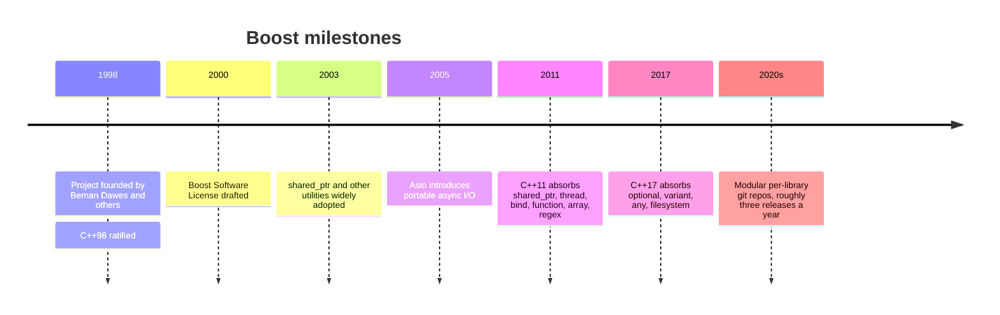

# History and Philosophy

Boost was born in 1998, the same year the first ISO C++ standard (C++98) was ratified. That timing is
no coincidence. Several members of the standardization committee — most prominently **Beman Dawes**,
who co-founded the project — wanted a place to incubate the library ideas that the brand-new standard
had *not* included. Boost became that place: an open, community-run workshop where C++ libraries could
be designed, scrutinised, and hardened in the open before anyone proposed them for the standard.

:::info The one-line origin story
Boost exists because the C++ standard library was deliberately small, and standardisation is slow. A
group of committee members wanted to keep building high-quality, portable libraries *between* standard
revisions — and to do it in public, with peer review, under a permissive license.
:::

## Origins: 1998 and the standardization connection

The early C++ standard library shipped containers, iostreams, strings, and a handful of algorithms —
and not much else. There was no smart pointer in wide use, no portable filesystem access, no threads,
no regular expressions. Real projects filled those gaps with their own ad-hoc utilities, and everyone
reinvented the same wheels slightly differently.

Beman Dawes and Robert Klarer floated the idea of a shared library collection, and the name "Boost"
stuck — partly as a friendly contrast to the STL, partly because the goal was to *boost* what C++
developers could do out of the box. Because the founders were active on the committee, Boost adopted a
guiding ambition from day one: write libraries to the same quality bar as the standard, so that the
best of them could one day *become* the standard.

## The review process

What separates Boost from a typical "awesome list" of C++ utilities is the **formal review**. A
library does not enter Boost because its author is well known or its code looks clean. It enters
because the community formally evaluated it and a **review manager** declared it accepted.

The mechanics, conducted largely on the Boost developers' mailing list, look like this:

1. An author proposes a library and develops it, usually with feedback from the list.
2. The library enters a **review queue** and a volunteer review manager schedules a review window
   (typically about ten days).
3. During the window, anyone may submit a review answering one central question: *should this library
   be accepted into Boost?* Reviewers weigh design, documentation, implementation, portability, and
   whether the library is genuinely useful.
4. The review manager reads the reviews and issues a verdict — accept, accept with conditions, or
   reject — along with a rationale.

:::note Acceptance is not forever
Acceptance is a quality gate, not a popularity contest, and the bar is high — well-regarded libraries
have been rejected and resubmitted after redesign. The mailing list remains the project's backbone for
proposals, design debate, and release coordination.
:::

## Design principles

Boost's culture is captured by a small set of recurring principles. They explain why the libraries
feel the way they do.

- **Portability first.** A Boost library is expected to work across a wide matrix of compilers and
  platforms, not just the author's favourite. Compiler quirks are abstracted away — that is the entire
  job of [Boost.Config](../01-build-and-integration/boost-config.md).
- **Don't reinvent `std`.** Boost aims to *extend* the standard library, not compete with it. Where the
  standard already provides something adequate, Boost defers to it. Where Boost predates the standard
  feature, it tracks the standard's interface closely so migration is painless. See
  [Boost and the C++ standard](./boost-and-the-standard.md).
- **Minimal dependencies and header-only where possible.** Most libraries are usable by adding an
  include path alone, with no separate build step. This keeps adoption friction low — see
  [header-only vs compiled](./header-only-vs-compiled.md).
- **Peer review and documentation.** A library is not "done" until it is documented well enough that a
  newcomer can use it. Reviewers treat poor docs as a blocking defect.
- **Generic, idiomatic C++.** Boost leans heavily on templates and generic programming, often pushing
  the language further than the standard had at the time — and discovering the rough edges that later
  feed back into the language itself.

:::tip Read this as a quality signal
When you pick up a Boost library, you are getting something that survived public review, is documented,
and is expected to compile on compilers you may never personally touch. That is the practical payoff of
these principles.
:::

## The Boost Software License

Early Boost libraries carried a patchwork of licenses, which made the collection awkward to adopt in
commercial settings. Around 2003 the project consolidated on a single, deliberately **permissive**
license: the **Boost Software License 1.0**.

Its key properties:

- It permits use, modification, and distribution in both open-source and **closed-source** products.
- It requires the copyright/license notice to be reproduced only in **source** distributions — there is
  **no attribution requirement in compiled binaries**.
- It is short, OSI-approved, and GPL-compatible.

That last point about binaries is the practical headline: you can ship a closed-source product built on
Boost without burying a license notice in your application's About box. This made Boost safe to adopt
across industry.

:::tip When in doubt, the license is friendly
The Boost Software License is one of the most permissive in common use. For most teams it raises no
legal concerns — but always confirm with whoever owns licensing decisions at your organisation.
:::

## Boost as the standard's proving ground

The principle that ties everything together is Boost's role as a **proving ground** for the ISO C++
standard. Because the founders and many contributors sit on the committee, a well-worn pipeline exists:
an idea is built in Boost, used in real projects for years, refined through bug reports and breaking
changes, and only *then* proposed for standardisation with the confidence that comes from field
experience.

This is why `std::shared_ptr`, `std::thread`, `std::function`, `std::optional`, `std::variant`,
`std::any`, and `std::filesystem` all have Boost ancestors. Boost let the committee standardise designs
that were already proven, rather than inventing them on paper. The full lineage and guidance on
choosing between `boost::X` and `std::X` lives on
[Boost and the C++ standard](./boost-and-the-standard.md).

## Where to go next

- <Icon icon="lucide:book-open" inline /> [What is Boost?](./what-is-boost.md) — the high-level overview.
- <Icon icon="lucide:arrow-left-right" inline /> [Boost and the C++ standard](./boost-and-the-standard.md) — the `std` lineage in detail.
- <Icon icon="lucide:git-fork" inline /> [Versioning and releases](./versioning-and-releases.md) — how the project ships today.
- <Icon icon="lucide:hammer" inline /> [Installing Boost](./installation.md) — get it onto your machine.
- <Icon icon="lucide:library" inline /> [Boost overview](../readme.md) — browse the full library catalogue.
