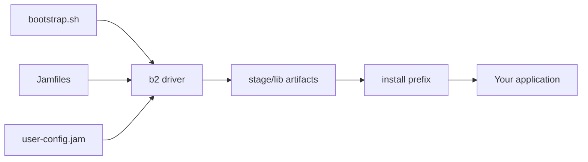

# Boost.Build (b2)

Boost.Build is Boost's *own* build system — the toolchain Boost uses to compile itself. Its driver
program is called `b2` (historically `bjam`), and its build scripts are *Jamfiles* written in a
declarative language called Jam. For most of Boost's history this was the canonical way to build and
install the compiled libraries, so even if you never author a Jamfile yourself you will run into `b2`
the first time you build Boost from source.

:::info What you actually need to know
The vast majority of Boost users today never touch a Jamfile. They consume Boost through
[CMake](./cmake-integration.md), a [package manager](./package-managers.md), or a system package, and
only invoke `b2` once — to compile the handful of [non-header-only libraries](../00-overview/header-only-vs-compiled.md).
This page explains that one interaction, then what Jamfiles are for completeness.
:::

## When you meet b2: building Boost from source

When you download a Boost release and want the compiled libraries (Filesystem, Thread,
Program_options, and friends), the workflow is always the same two steps: bootstrap, then build.

```bash
# 1. From the unpacked Boost source tree, build the b2 driver itself
./bootstrap.sh                 # Linux/macOS  (use bootstrap.bat on Windows)

# 2. Build everything and stage the compiled libraries into ./stage/lib
./b2
```

`bootstrap.sh` is a tiny shell script whose only job is to compile the `b2` executable from its C++
sources and write an initial `project-config.jam`. After that, `./b2` with no arguments builds all
the compiled libraries using sensible defaults and drops the results in `stage/lib`.

:::note Header-only libraries need no build at all
`b2` only produces artifacts for the compiled libraries. Header-only components (the majority of
Boost) work the moment the include root is on your compiler's search path. See
[header-only vs compiled](../00-overview/header-only-vs-compiled.md) for the split.
:::

## Staging vs installing

There are two destinations for the libraries `b2` produces, and the distinction trips people up.

| Command | What it does | Typical use |
|---------|--------------|-------------|
| `./b2` (or `./b2 stage`) | Builds libraries into `./stage/lib` inside the source tree | Local experiments; point your `-L` at `stage/lib` |
| `./b2 install --prefix=DIR` | Copies headers to `DIR/include` and libraries to `DIR/lib` | A real, system-wide or per-prefix installation |

```bash
# Stage only (default) — artifacts stay inside the source tree
./b2

# Full install into a chosen prefix
./b2 install --prefix=/opt/boost-1.85
```

After an install the layout under the prefix looks like `include/boost/...` for headers and
`lib/libboost_*.{a,so}` for the compiled libraries — exactly what a compiler or
[CMake's find_package](./cmake-integration.md) expects to find. See
[Installing Boost](../00-overview/installation.md) for the broader picture of where Boost lands on
each platform.

## The knobs that matter

`b2` accepts feature requests as `name=value` pairs on the command line. These are the ones worth
knowing, because they map directly onto questions you will be asked when packaging or linking.

```bash
./b2 \
  variant=release \          # optimised build (vs variant=debug)
  link=static,shared \       # produce both .a/.lib and .so/.dll
  runtime-link=shared \      # link the C++ runtime dynamically
  threading=multi \          # thread-safe builds
  --with-filesystem \        # build only selected libraries
  --with-system \
  -j8 \                      # parallel jobs
  install --prefix=/opt/boost-1.85
```

- **`variant=debug|release`** — the build configuration. `release` enables optimisation and defines
  `NDEBUG`; `debug` keeps assertions and debug symbols. You can request both at once
  (`variant=debug,release`).
- **`link=static|shared`** — whether to produce static archives, shared objects, or both. This is the
  producer-side counterpart to CMake's `Boost_USE_STATIC_LIBS` consumer knob, covered on the
  [CMake page](./cmake-integration.md).
- **`runtime-link=shared|static`** — whether the C and C++ *runtime* is linked dynamically or
  statically. On MSVC, mixing this incorrectly between Boost and your application is a classic source
  of link errors.
- **`threading=multi|single`** — multi-threaded builds are the sensible default; single-threaded
  variants are largely historical.
- **`--with-LIB` / `--without-LIB`** — build a subset instead of everything, which is dramatically
  faster when you only need one or two compiled libraries.

:::warning Match the ABI between Boost and your application
`variant`, `runtime-link`, the standard-library version, and the toolset all contribute to the binary
interface. If Boost was built `release / runtime-link=shared` with one compiler and you link it into a
`debug / runtime-link=static` application built with another, you can get link-time failures or — worse
— silent ODR violations at runtime. Keep these settings consistent.
:::

## Toolsets

A *toolset* tells `b2` which compiler to drive. Pass it with `toolset=`:

```bash
./b2 toolset=gcc                 # GCC
./b2 toolset=clang               # Clang
./b2 toolset=msvc                # Microsoft Visual C++
./b2 toolset=gcc-13 cxxstd=20    # a specific GCC, targeting C++20
```

`cxxstd=` selects the language standard Boost itself is compiled against. For multiple compilers on
one machine you can register them in `user-config.jam` and refer to them by name.

## What a Jamfile looks like

If you do author Boost.Build targets, you write Jamfiles. The language is terse and declarative — a
target is a rule invocation listing sources, dependencies, and requirements.

```jam
# A minimal Jamfile that builds an app against compiled Boost libraries
project my-app ;

exe app
    : main.cpp                     # sources
      /boost//filesystem           # dependency on the Boost.Filesystem target
      /boost//system
    : <cxxflags>-std=c++17         # requirements applied to this target
    ;
```

The `flowchart` below shows where each piece sits in the build, from bootstrap to a linkable library.



## Should you use Boost.Build for your project?

Almost certainly not. Boost.Build is excellent at building *Boost*, but the wider C++ ecosystem has
consolidated around CMake plus a package manager. Jam is an unfamiliar language to most teams, IDE and
tooling support is thin, and integrating non-Boost dependencies is awkward.

:::tip Recommended path for consumers
Build or obtain Boost once — via `b2 install`, a [package manager](./package-managers.md), or your OS
package — then consume it from your project with [CMake](./cmake-integration.md). Author Jamfiles only
if you are contributing to Boost itself.
:::

## Where to go next

- <Icon icon="lucide:hammer" inline /> [Using Boost with CMake](./cmake-integration.md) — the modern way to consume what `b2` builds.
- <Icon icon="lucide:package" inline /> [Boost via vcpkg and Conan](./package-managers.md) — let a package manager run `b2` for you.
- <Icon icon="lucide:book-open" inline /> [Installing Boost](../00-overview/installation.md) — platform-by-platform installation options.
- <Icon icon="lucide:puzzle" inline /> [Header-only vs compiled libraries](../00-overview/header-only-vs-compiled.md) — which libraries `b2` actually needs to build.
- [Boost overview](../readme.md) — the full library index.
