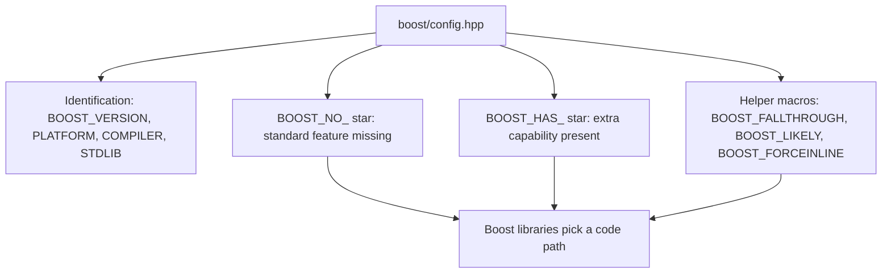

# Boost.Config (Portability Macros)

Boost.Config is the quiet foundation almost every other Boost library sits on. Its job is to detect
the compiler, the platform, and the standard-library implementation you are building with, and to
expose that knowledge as a stable set of preprocessor macros. Where compilers disagree about which
language features they support — or implement the same feature with subtly different bugs —
Boost.Config papers over the difference so the rest of Boost can be written once and compiled
everywhere.

:::info Why this library exists
Boost has always supported a wide range of compilers, including old and non-conforming ones. Rather
than scatter `#ifdef _MSC_VER` and `#ifdef __GNUC__` checks through every library, Boost centralises
all of that detection in one place. A library author asks a clean question — "does this compiler have
working `noexcept`?" — instead of memorising each toolchain's quirks.
:::

## The single header

You pull the whole detection layer in with one include:

```cpp showLineNumbers
#include <boost/config.hpp>
```

After this, hundreds of macros are defined describing exactly what the current toolchain can and
cannot do. You rarely include it directly in application code — but every Boost library you use
includes it for you, which is why Boost compiles cleanly across compilers that disagree wildly about
feature support.

## Identification macros

The first thing Boost.Config gives you is a consistent way to name the environment, regardless of
which compiler you are on.

```cpp showLineNumbers title="env_report.cpp"
#include <boost/config.hpp>
#include <iostream>

int main() {
    std::cout << "Boost version:  " << BOOST_VERSION << '\n';   // e.g. 108500
    std::cout << "Platform:       " << BOOST_PLATFORM << '\n';  // e.g. "linux"
    std::cout << "Compiler:       " << BOOST_COMPILER << '\n';  // e.g. "GNU C++ version 13.2.0"
    std::cout << "Std library:    " << BOOST_STDLIB   << '\n';  // e.g. "GNU libstdc++ ..."
}
```

| Macro | Meaning |
|-------|---------|
| `BOOST_VERSION` | Boost version as a single integer, `major * 100000 + minor * 100 + patch` (so `108500` is 1.85.0) |
| `BOOST_PLATFORM` | Human-readable platform/OS name |
| `BOOST_COMPILER` | Human-readable compiler name and version |
| `BOOST_STDLIB` | Human-readable standard-library implementation name |

:::note Decoding BOOST_VERSION
The integer form is deliberately easy to compare. To recover the parts: major is
`BOOST_VERSION / 100000`, minor is `BOOST_VERSION / 100 % 1000`, and patch is `BOOST_VERSION % 100`.
For versioning context across releases see [Versioning and Releases](../00-overview/versioning-and-releases.md).
:::

## Feature macros: the BOOST_NO_* family

The heart of Boost.Config is the **`BOOST_NO_*`** macros. Each one is *defined* when the current
toolchain **lacks** a given feature, and left *undefined* when the feature works. The negative sense
is deliberate: a missing macro means "this works", so well-behaved modern compilers define almost
none of them.

```cpp showLineNumbers
#include <boost/config.hpp>

#if defined(BOOST_NO_CXX17_STRUCTURED_BINDINGS)
    // Fallback path for toolchains without structured bindings.
    std::pair<int, int> p = compute();
    int a = p.first;
    int b = p.second;
#else
    auto [a, b] = compute();    // preferred when available
#endif
```

Historically these covered fundamentals like `BOOST_NO_CXX11_RVALUE_REFERENCES`,
`BOOST_NO_CXX11_NOEXCEPT`, and `BOOST_NO_CXX11_CONSTEXPR`; newer ones track later standards, such as
`BOOST_NO_CXX17_STRUCTURED_BINDINGS` or `BOOST_NO_CXX14_GENERIC_LAMBDAS`. On a current compiler most
are undefined — but they are exactly how Boost keeps building on the long tail of older toolchains it
still supports.

## Capability macros: the BOOST_HAS_* family

The mirror image is **`BOOST_HAS_*`**, which is defined when a *non-standard but useful* facility is
available — typically a platform or compiler extension that is not part of standard C++.

```cpp showLineNumbers
#include <boost/config.hpp>

#if defined(BOOST_HAS_THREADS)
    // Safe to use thread-aware code paths.
#endif

#if defined(BOOST_HAS_NANOSLEEP)
    // POSIX nanosleep is available on this platform.
#endif
```

So the two families answer different questions: `BOOST_NO_*` asks "is this *standard* feature
missing?", while `BOOST_HAS_*` asks "is this *extra* capability present?".



## Helper and annotation macros

Beyond detection, Boost.Config ships portable spellings of compiler annotations that did not always
exist as standard syntax. They expand to the native attribute when supported and to nothing when not.

```cpp showLineNumbers
#include <boost/config.hpp>

switch (state) {
    case A:
        do_a();
        BOOST_FALLTHROUGH;          // portable [[fallthrough]]
    case B:
        do_b();
        break;
}

// Branch-prediction hints, portable across compilers.
if (BOOST_LIKELY(ptr != nullptr)) {
    use(ptr);
}

// Force inlining where the compiler supports it.
BOOST_FORCEINLINE int square(int x) { return x * x; }
```

- **`BOOST_FALLTHROUGH`** — portable equivalent of `[[fallthrough]]`, silencing fall-through warnings
  on compilers that lacked the attribute.
- **`BOOST_LIKELY` / `BOOST_UNLIKELY`** — branch-prediction hints, predating the C++20 `[[likely]]`
  and `[[unlikely]]` attributes.
- **`BOOST_FORCEINLINE` / `BOOST_NOINLINE`** — portable inlining controls that map to
  `__forceinline`, `__attribute__((always_inline))`, and similar.
- **`BOOST_CONSTEXPR` / `BOOST_NOEXCEPT`** — expand to the keyword where supported, to nothing where
  not, so a single source line works on toolchains old and new.

:::tip Prefer standard attributes in new code
On a modern C++17/20 toolchain, write `[[fallthrough]]`, `[[likely]]`, and `noexcept` directly. The
`BOOST_*` spellings earn their keep when your code must also compile on older or non-conforming
compilers — exactly the situation Boost libraries themselves are in.
:::

## BOOST_STATIC_ASSERT: a feature that graduated

Before C++11 there was no `static_assert` keyword, so Boost provided `BOOST_STATIC_ASSERT` as a
library macro that produced a compile-time error on a false condition. It was one of the most widely
used pieces of Boost portability machinery.

```cpp showLineNumbers
#include <boost/static_assert.hpp>

BOOST_STATIC_ASSERT(sizeof(int) >= 4);

// With a message (maps to static_assert where available):
BOOST_STATIC_ASSERT_MSG(sizeof(void*) == 8, "expected a 64-bit target");
```

Today `BOOST_STATIC_ASSERT` is simply a thin wrapper over the language's `static_assert` when the
compiler has it. This is the recurring Boost story: a facility prototyped as a portability macro, then
absorbed into the language, after which the Boost macro becomes a compatibility shim. The same arc is
described for whole libraries in [Boost and the C++ Standard](../00-overview/boost-and-the-standard.md).

:::warning Do not redefine these macros
Boost.Config macros encode delicate, compiler-specific knowledge. Never `#define` or `#undef` a
`BOOST_*` macro yourself to "fix" a build — you will silently break the assumptions every other Boost
library makes about the environment. If detection is wrong, report it upstream rather than overriding
it locally.
:::

## How libraries use it internally

When you read Boost source you will constantly see this header drive feature selection. A library
detects a missing feature and falls back, or detects a present capability and optimises:

```cpp showLineNumbers
#include <boost/config.hpp>

namespace boost {
namespace detail {

#if defined(BOOST_NO_CXX11_HDR_TUPLE)
    // Use Boost.Tuple on toolchains lacking <tuple>.
#else
    // Use std::tuple directly.
#endif

}  // namespace detail
}  // namespace boost
```

This is why a header-only library like [Optional](../02-core-utilities/boost-optional.md) can present
one clean interface yet compile across a decade of compilers: Boost.Config absorbs the variation so
the public API never has to. It is the portability guarantee behind the whole collection — see
[What is Boost?](../00-overview/what-is-boost.md) for where that fits in Boost's philosophy.

## Where to go next

- <Icon icon="lucide:hammer" inline /> [Using Boost with CMake](./cmake-integration.md) — get Boost building before its macros matter.
- <Icon icon="lucide:arrow-left-right" inline /> [Boost and the C++ Standard](../00-overview/boost-and-the-standard.md) — the pattern of macros and libraries graduating into `std`.
- <Icon icon="lucide:book-open" inline /> [Versioning and Releases](../00-overview/versioning-and-releases.md) — decoding `BOOST_VERSION` and the release cadence.
- <Icon icon="lucide:puzzle" inline /> [Header-only vs compiled](../00-overview/header-only-vs-compiled.md) — Boost.Config is header-only and used everywhere.
- [Boost overview](../readme.md) — the full library index.
