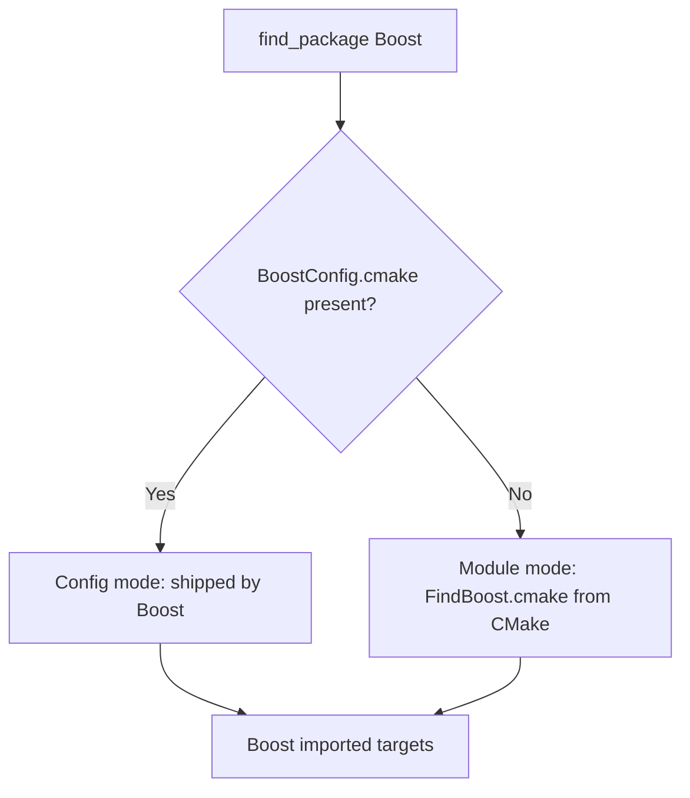

# Using Boost with CMake

CMake is how most projects consume Boost today. Instead of hand-rolling include paths and `-lboost_*`
flags, you ask CMake to *find* Boost and then link against well-named **imported targets** that carry
the include directories, link libraries, and compile definitions automatically. This page covers the
whole flow: locating Boost, the two discovery mechanisms, the imported targets, the configuration
knobs, and pulling Boost in with `FetchContent` when no system copy exists.

:::info The one rule that prevents most pain
Link against the **imported targets** (`Boost::headers`, `Boost::filesystem`, ...), never against raw
variables like `${Boost_LIBRARIES}`. Targets propagate include directories and definitions
transitively, so a single `target_link_libraries` call configures the consumer correctly.
:::

## The minimal working example

A complete project that uses a header-only Boost component plus one compiled component
([Boost.Filesystem](../10-io-and-system/boost-filesystem.md)):

```cmake
cmake_minimum_required(VERSION 3.20)
project(my_app CXX)

set(CMAKE_CXX_STANDARD 17)
set(CMAKE_CXX_STANDARD_REQUIRED ON)

# Locate Boost and the components that need linking.
find_package(Boost 1.75 REQUIRED COMPONENTS filesystem)

add_executable(my_app main.cpp)

# Link the imported targets. Include dirs and definitions come along for free.
target_link_libraries(my_app PRIVATE Boost::filesystem Boost::headers)
```

```cpp showLineNumbers title="main.cpp"
#include <boost/filesystem.hpp>
#include <iostream>

namespace fs = boost::filesystem;

int main() {
    for (const auto& entry : fs::directory_iterator(".")) {
        std::cout << entry.path().string() << '\n';
    }
}
```

`find_package(Boost ...)` does the discovery; `target_link_libraries` wires the result into your
target. Notice there is no manual `include_directories` and no `-lboost_filesystem` — the
`Boost::filesystem` target supplies both.

## find_package: components and version

The signature you will use almost every time:

```cmake
find_package(Boost <min-version> REQUIRED COMPONENTS <compiled-libs...>)
```

- **`<min-version>`** — an optional minimum, e.g. `1.75`. Add `EXACT` to demand a precise version.
- **`REQUIRED`** — fail configuration immediately if Boost is missing, instead of leaving result
  variables empty.
- **`COMPONENTS`** — list only the **compiled** libraries you link against (`filesystem`, `system`,
  `thread`, `program_options`, `serialization`, ...). Header-only components such as
  [Optional](../02-core-utilities/boost-optional.md) or [Asio](../09-concurrency-and-async/boost-asio.md)
  do **not** go here — they are reached through `Boost::headers`.

```cmake
# Several compiled components at once
find_package(Boost 1.81 REQUIRED COMPONENTS filesystem system program_options)

target_link_libraries(server PRIVATE
    Boost::filesystem
    Boost::system
    Boost::program_options)
```

:::tip COMPONENTS is only for compiled libraries
A frequent mistake is listing a header-only library, e.g. `COMPONENTS optional`, which makes
`find_package` fail because there is no `libboost_optional` to find. For header-only code, just link
`Boost::headers` and include the header. The split is explained in
[header-only vs compiled](../00-overview/header-only-vs-compiled.md).
:::

## Imported targets

A successful `find_package` defines these `INTERFACE`/imported targets:

| Target | Provides | Use for |
|--------|----------|---------|
| `Boost::headers` | The Boost include root | Any header-only library (also aliased as `Boost::boost`) |
| `Boost::filesystem` | Link to `libboost_filesystem` + headers | Boost.Filesystem |
| `Boost::system` | Link to `libboost_system` + headers | Boost.System (a common transitive dependency) |
| `Boost::thread` | Link + threading flags | Boost.Thread |
| `Boost::<component>` | One target per requested component | Each library in `COMPONENTS` |

Each target carries its dependencies, so linking `Boost::filesystem` also pulls in whatever it needs
(historically `Boost::system`). You list what you *use*; CMake resolves the rest.

## Discovery: BoostConfig vs the FindBoost module

There are two distinct mechanisms behind `find_package(Boost)`, and knowing which one ran explains a
lot of confusing behaviour.



- **Config mode** uses `BoostConfig.cmake`, a package config file **shipped by Boost itself** (since
  Boost 1.70). Because Boost wrote it, it always knows about that version's components — it never
  needs to be taught about new libraries.
- **Module mode** uses `FindBoost.cmake`, a finder **bundled with CMake**. It works for older Boost
  installs that predate `BoostConfig.cmake`, but it must be updated by the CMake project to recognise
  newer Boost versions — hence the occasional "imported targets not available for Boost version"
  warning when an old CMake meets a new Boost.

:::warning Old CMake plus new Boost
If you see `New Boost version may have incorrect or missing dependencies` or missing
`Boost::` targets, you are almost certainly in **module mode** with a CMake too old for your Boost.
Fixes: upgrade CMake, set `Boost_NO_BOOST_CMAKE` appropriately, or prefer config mode by ensuring
`BoostConfig.cmake` is on `CMAKE_PREFIX_PATH`.
:::

## Configuration knobs

These variables shape what `find_package` looks for. Set them **before** the `find_package` call.

```cmake
set(Boost_USE_STATIC_LIBS ON)        # prefer libboost_*.a / .lib over shared
set(Boost_USE_MULTITHREADED ON)      # prefer the -mt (threaded) variants
set(Boost_USE_STATIC_RUNTIME OFF)    # link the C++ runtime dynamically (MSVC)
set(BOOST_ROOT "/opt/boost-1.85")    # hint: where Boost is installed
set(Boost_NO_SYSTEM_PATHS ON)        # ignore system dirs; use BOOST_ROOT only

find_package(Boost 1.81 REQUIRED COMPONENTS filesystem)
```

- **`Boost_USE_STATIC_LIBS`** — choose the static archives instead of shared libraries. This must
  match how Boost was built (`link=static` in [b2](./boost-build-b2.md)); requesting static libs that
  were never produced makes the find fail.
- **`Boost_USE_STATIC_RUNTIME`** — on MSVC, controls whether you pick the variant that links the
  runtime statically. Mismatching this against your own `/MT` vs `/MD` setting causes link errors.
- **`BOOST_ROOT`** — the single most useful hint when Boost lives in a non-standard prefix.
- **`Boost_DEBUG`** — set `ON` temporarily to make the finder print exactly which paths and variants
  it considered; invaluable when discovery misbehaves.

:::note Result variables still exist
`find_package` also sets `Boost_FOUND`, `Boost_VERSION`, `Boost_INCLUDE_DIRS`, and `Boost_LIBRARIES`.
They remain for legacy scripts, but prefer the imported targets — they propagate usage requirements
that the bare variables do not.
:::

## Pulling Boost in with FetchContent

When you would rather vendor Boost into the build than rely on a system copy,
`FetchContent` can download and add it as a subproject. Modern Boost ships a top-level
`CMakeLists.txt`, so it integrates as a normal dependency.

```cmake
include(FetchContent)

FetchContent_Declare(
    Boost
    URL https://github.com/boostorg/boost/releases/download/boost-1.85.0/boost-1.85.0-cmake.tar.xz
    URL_HASH SHA256=<paste-the-published-hash-here>
)

# Build only the libraries you need to keep configure/build times sane.
set(BOOST_INCLUDE_LIBRARIES filesystem system)
FetchContent_MakeAvailable(Boost)

target_link_libraries(my_app PRIVATE Boost::filesystem)
```

`BOOST_INCLUDE_LIBRARIES` restricts the super-project to the listed libraries (and their
dependencies), which matters because configuring all of Boost is slow. The same `Boost::<component>`
targets appear whether Boost was found on the system or fetched, so the rest of your CMake is
identical.

:::tip Prefer a package manager for FetchContent-style workflows
Downloading Boost through CMake works, but a dedicated [package manager](./package-managers.md) —
vcpkg or Conan — caches binaries, resolves versions, and supplies a toolchain file that makes
`find_package(Boost)` "just work". For most teams that is less friction than a raw `FetchContent`
block.
:::

## A quick decision guide

- **Boost already installed (system, `b2 install`, or package manager):** use
  `find_package(Boost REQUIRED COMPONENTS ...)` and link the imported targets. This is the default
  recommendation.
- **No system Boost, want a self-contained build:** `FetchContent` with `BOOST_INCLUDE_LIBRARIES`.
- **Reproducible cross-team builds:** a [package manager](./package-managers.md) toolchain file plus
  ordinary `find_package`.

## Where to go next

- <Icon icon="lucide:package" inline /> [Boost via vcpkg and Conan](./package-managers.md) — supply Boost to `find_package` through a toolchain file.
- <Icon icon="lucide:hammer" inline /> [Boost.Build (b2)](./boost-build-b2.md) — how the libraries CMake links were produced.
- <Icon icon="lucide:book-open" inline /> [Installing Boost](../00-overview/installation.md) — getting a copy CMake can find.
- <Icon icon="lucide:puzzle" inline /> [Header-only vs compiled](../00-overview/header-only-vs-compiled.md) — why only some libraries go in `COMPONENTS`.
- [Boost overview](../readme.md) — the full library index.
