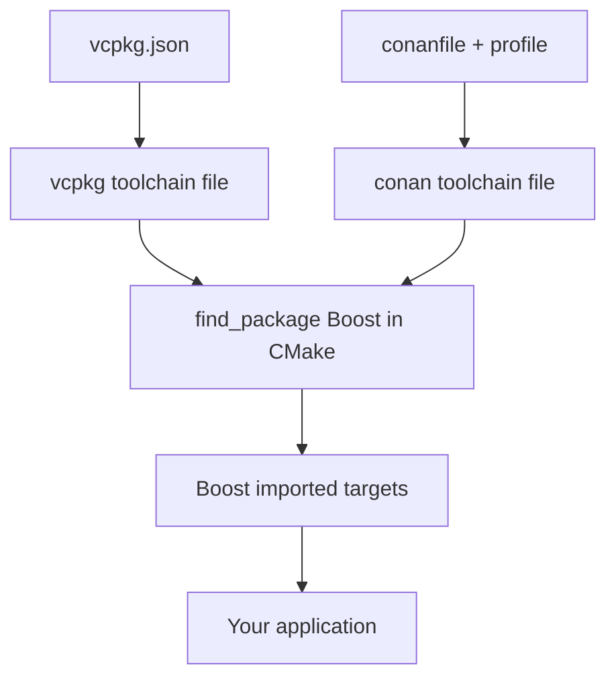

# Boost via vcpkg and Conan

Building Boost by hand with [b2](./boost-build-b2.md) works, but on a real team you want builds that
are reproducible, cached, and identical across machines. That is what C++ package managers provide.
The two dominant choices — **vcpkg** (Microsoft) and **Conan** (JFrog) — both package Boost, both
integrate with [CMake](./cmake-integration.md) through a toolchain file, and both let you pull in only
the Boost modules you need rather than the whole 160-library distribution.

:::info The shared idea
A package manager builds (or downloads a prebuilt) Boost, then hands CMake a *toolchain file*. With
that toolchain in place your `CMakeLists.txt` does nothing special — the ordinary
`find_package(Boost REQUIRED COMPONENTS ...)` simply finds the manager's copy. Your build scripts stay
manager-agnostic.
:::

## vcpkg

vcpkg has two modes. **Manifest mode** (recommended) records dependencies in a `vcpkg.json` file
checked into your repo; **classic mode** installs packages globally into a vcpkg instance.

### Manifest mode

Drop a `vcpkg.json` beside your top-level `CMakeLists.txt`. vcpkg reads it automatically at configure
time and installs exactly the listed modules.

```json
{
  "name": "my-app",
  "version": "0.1.0",
  "dependencies": [
    "boost-filesystem",
    "boost-program-options",
    "boost-asio"
  ]
}
```

Each Boost library is its own fine-grained port — `boost-filesystem`, `boost-asio`,
`boost-optional` — so you pull in only what you use plus its dependencies. There is also a meta-port
named `boost` that installs everything, which you almost never want.

```bash
# One-time: get vcpkg
git clone https://github.com/microsoft/vcpkg
./vcpkg/bootstrap-vcpkg.sh        # bootstrap-vcpkg.bat on Windows

# Configure your project, pointing CMake at the vcpkg toolchain.
cmake -B build -S . \
  -DCMAKE_TOOLCHAIN_FILE=vcpkg/scripts/buildsystems/vcpkg.cmake
cmake --build build
```

With the toolchain file set, configuration triggers the manifest install, and your unmodified CMake
finds the result:

```cmake
find_package(Boost REQUIRED COMPONENTS filesystem program_options)
target_link_libraries(my_app PRIVATE Boost::filesystem Boost::program_options)
```

### Classic mode

Classic mode installs into the vcpkg instance directly, decoupled from any one project:

```bash
./vcpkg/vcpkg install boost-filesystem boost-asio
# optionally pin a triplet (target ABI), e.g. static linkage:
./vcpkg/vcpkg install boost-filesystem:x64-windows-static
```

A *triplet* (`x64-linux`, `x64-windows-static`, `arm64-osx`, ...) encodes the target architecture and
whether libraries are static or shared — vcpkg's equivalent of the `link=static` choice you would pass
to [b2](./boost-build-b2.md).

:::tip Prefer manifest mode
Manifest mode keeps the dependency set in version control, so a fresh checkout reproduces the exact
build. Classic mode is convenient for one-off experimentation but drifts between machines.
:::

## Conan

Conan describes dependencies in a `conanfile` (either `conanfile.txt` or, for more control,
`conanfile.py`) and separates *what* you depend on from *how* it is built via **profiles**.

```ini
# conanfile.txt
[requires]
boost/1.85.0

[generators]
CMakeToolchain
CMakeDeps
```

The `CMakeToolchain` and `CMakeDeps` generators emit a toolchain file and the package config files
that `find_package` consumes. Install, then configure with the generated toolchain:

```bash
# Build (or fetch) Boost and generate CMake integration files
conan install . --output-folder=build --build=missing

# Configure using Conan's generated toolchain
cmake -B build -S . \
  -DCMAKE_TOOLCHAIN_FILE=build/conan_toolchain.cmake
cmake --build build
```

`--build=missing` tells Conan to compile from source only when no matching prebuilt binary exists in
the cache or a remote. Your CMake again stays ordinary:

```cmake
find_package(Boost REQUIRED COMPONENTS filesystem)
target_link_libraries(my_app PRIVATE Boost::filesystem)
```

### Selecting components and linkage with Conan

The Conan Boost recipe exposes *options* that control which libraries are built and how. Two common
ones: building only a subset, and choosing static vs shared.

```ini
# conanfile.txt
[requires]
boost/1.85.0

[options]
boost/*:shared=False                 # static libraries
boost/*:without_test=True            # skip building Boost.Test
boost/*:without_python=True          # skip the Python-dependent parts

[generators]
CMakeToolchain
CMakeDeps
```

### Profiles

A *profile* captures the build environment — compiler, version, C++ standard, build type, ABI — so it
can be reused and shared across a team.

```ini
# ~/.conan2/profiles/default
[settings]
os=Linux
arch=x86_64
compiler=gcc
compiler.version=13
compiler.cppstd=17
build_type=Release
```

```bash
# Use distinct profiles for, say, host and cross builds
conan install . -pr:h=android-arm64 -pr:b=default --build=missing
```

:::warning Keep the profile and your project in sync
The compiler, standard library, and `build_type` in the active profile determine the ABI of the Boost
binaries Conan produces. If your CMake project compiles with a different standard or runtime than the
profile declares, you can hit the same link-time and ODR problems described on the
[b2 page](./boost-build-b2.md). Treat the profile as the single source of truth for ABI.
:::

## How they plug into CMake

Both managers funnel through the same CMake entry point. The diagram shows why your build scripts do
not need to know which manager is in use.



Because the toolchain file makes `find_package` succeed, the [CMake integration](./cmake-integration.md)
patterns — imported targets, `COMPONENTS`, `Boost_USE_STATIC_LIBS` — apply unchanged regardless of how
Boost arrived.

## Package manager vs system package

| | Package manager (vcpkg/Conan) | System package (`apt`, `brew`, ...) |
|---|---|---|
| Version control | Exact version pinned per project | Whatever the distro ships |
| Reproducibility | High — same recipe everywhere | Varies by machine and distro release |
| Multiple versions | Easy, side by side | Painful; usually one global version |
| First-build cost | May compile Boost (slow once) | Instant install of prebuilt binaries |
| Component granularity | Per-library ports/options | Often one big `libboost-all-dev` |
| Best for | Cross-platform, multi-version, CI | Quick local setup, throwaway work |

:::tip Choosing between them
Use a **package manager** when you need reproducible, pinned, cross-platform builds — especially in
CI. Reach for a **system package** (covered in [Installing Boost](../00-overview/installation.md))
when you just want a recent Boost on your own machine and don't care about exact versions. Between the
two managers, the practical tie-breaker is ecosystem fit: vcpkg integrates tightly with CMake and
Visual Studio; Conan offers richer versioning, binary caching, and profile-based ABI control.
:::

## Where to go next

- <Icon icon="lucide:hammer" inline /> [Using Boost with CMake](./cmake-integration.md) — the consumer-side patterns these toolchains feed.
- <Icon icon="lucide:wrench" inline /> [Boost.Build (b2)](./boost-build-b2.md) — what the managers run under the hood when building from source.
- <Icon icon="lucide:book-open" inline /> [Installing Boost](../00-overview/installation.md) — system packages and manual installs.
- <Icon icon="lucide:puzzle" inline /> [Header-only vs compiled](../00-overview/header-only-vs-compiled.md) — which modules actually need building.
- [Boost overview](../readme.md) — the full library index.
