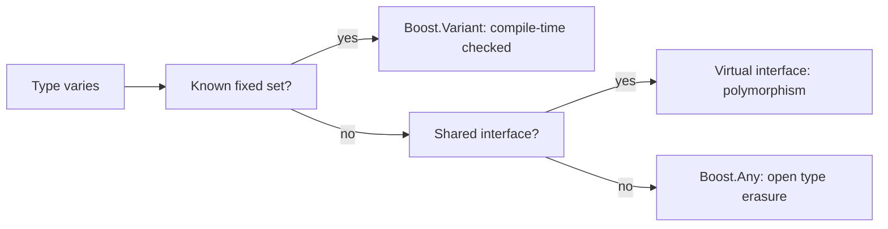

# Boost.Any

`boost::any` is a container for a **single value of any type**, decided at runtime. Where
[Boost.Variant](./boost-variant.md) holds one of a *fixed, known* set of types, `any` holds one of an
*open, unknown* set — you can store an `int` today and a `std::vector<std::string>` tomorrow in the same
variable. This is classic **type erasure**, and it inspired C++17's `std::any`.

:::info When you genuinely do not know the type
`any` is for the rare situation where the set of possible types is open-ended or only known by external
data — plugin systems, scripting bridges, generic property bags, message buses. If you can enumerate the
types up front, a variant is almost always the better tool.
:::

## Storing and retrieving

A value goes in by simple assignment. Getting it back requires `boost::any_cast`, and you must name the
exact stored type — there are no implicit conversions.

```cpp showLineNumbers title="any_basics.cpp"
#include <boost/any.hpp>
#include <string>
#include <iostream>

int main() {
    boost::any a = 42;                 // holds int
    a = std::string("hello");          // now holds std::string

    // Value form: throws boost::bad_any_cast on type mismatch.
    std::string s = boost::any_cast<std::string>(a);
    std::cout << s << "\n";

    // Pointer form: returns nullptr on mismatch, no exception.
    if (int* p = boost::any_cast<int>(&a)) {
        std::cout << *p << "\n";       // not reached: a holds a string
    }
}
```

:::warning any_cast is exact-match only
`boost::any_cast<long>(a)` on an `any` holding an `int` **throws** — type erasure remembers the precise
`typeid`, and there is no arithmetic conversion. Cast to the type you stored, then convert.
:::

## Inspecting and emptying

```cpp showLineNumbers
#include <boost/any.hpp>
#include <typeinfo>

void inspect(const boost::any& a) {
    if (a.empty()) return;             // default-constructed or cleared
    const std::type_info& t = a.type(); // the stored type's typeid
    (void)t;
}
```

An `any` constructed with no argument is **empty**; assigning `boost::any()` clears it. `type()` exposes
the `std::type_info` of the stored object, which you can pair with
[`boost::core::demangle`](./boost-core.md) for readable diagnostics.

## A concrete use: a heterogeneous property bag

```cpp showLineNumbers title="property_bag.cpp"
#include <boost/any.hpp>
#include <map>
#include <string>

class Properties {
    std::map<std::string, boost::any> data_;
public:
    template <class T>
    void set(const std::string& key, T value) { data_[key] = std::move(value); }

    template <class T>
    T get(const std::string& key) const {
        return boost::any_cast<T>(data_.at(key));  // throws if wrong type
    }
};

int main() {
    Properties p;
    p.set("width", 1920);
    p.set("title", std::string("main window"));
    int w = p.get<int>("width");
    (void)w;
}
```

## any versus variant versus virtual functions

These three are the standard answers to "I need to handle values whose type varies", and they sit at
different points on the openness/safety spectrum.



| Approach | Type set | Checking | Access cost | Best for |
|----------|----------|----------|-------------|----------|
| `variant` | fixed, known | compile-time (visitor) | cheap, in-place | enumerable alternatives |
| virtual interface | open, shares behaviour | compile-time on interface | vtable dispatch | polymorphic behaviour |
| `any` | open, unrelated types | runtime (`any_cast`) | type check + maybe heap | truly unknown types |

:::tip Reach for variant first
Most "I need a flexible value" problems actually have a small, known set of types — use a variant and
let the compiler check exhaustiveness. Choose `any` only when the types are genuinely open and share no
common interface, because all the safety moves to *runtime*.
:::

## Boost.Any versus std::any

C++17 standardised the concept as `std::any`, with essentially the same interface.

| Aspect | `boost::any` | `std::any` (C++17) |
|--------|--------------|---------------------|
| Header | `<boost/any.hpp>` | `<any>` |
| Cast | `boost::any_cast<T>` | `std::any_cast<T>` |
| Bad cast | `boost::bad_any_cast` | `std::bad_any_cast` |
| Emptiness | `a.empty()` | `a.has_value()` |
| In-place build | `boost::any(...)` | `std::make_any<T>`, `emplace` |
| Small-object optimisation | implementation-dependent | typically yes |

:::note Which to use
On C++17+, prefer `std::any` — it is standard, needs no dependency, and commonly stores small types
without heap allocation. Use `boost::any` for pre-C++17 toolchains or code already inside the Boost
dependency graph. See [Boost and the C++ Standard](../00-overview/boost-and-the-standard.md).
:::

## See also

- <Icon icon="lucide:boxes" inline /> [Boost.Variant](./boost-variant.md) — the type-safe choice when the type set is fixed.
- <Icon icon="lucide:puzzle" inline /> [Boost.Optional](./boost-optional.md) — for the simpler "value or nothing" case.
- <Icon icon="lucide:wrench" inline /> [Boost.Core](./boost-core.md) — `demangle` for readable `any.type()` names.
- <Icon icon="lucide:arrow-left-right" inline /> [Boost and the C++ Standard](../00-overview/boost-and-the-standard.md) — the `std::any` lineage.
- <Icon icon="lucide:book-open" inline /> [Boost overview](../readme.md).
