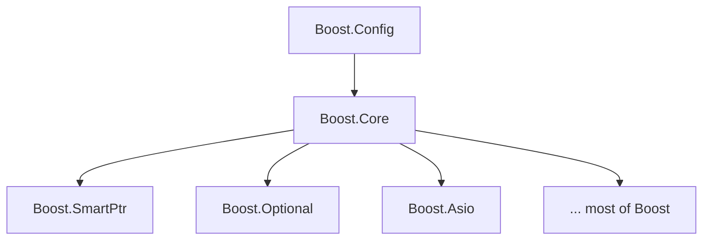

# Boost.Core

Boost.Core is the **dependency-light foundation** of the whole Boost ecosystem: a grab-bag of small,
fundamental utilities that almost every other Boost library leans on. The defining rule of Core is
that it depends on almost nothing — at most Boost.Config and Boost.Assert. That discipline is what
lets `shared_ptr`, `optional`, `asio`, and dozens of others build on top of it without dragging in a
sprawling dependency graph.

:::info What "Core" means here
Boost.Core is deliberately tiny and *boring*. Each header solves one small problem — taking a real
address, wrapping a reference, forbidding copies — and does so with no transitive baggage. If you find
yourself reaching for one of these helpers, you almost certainly already have it available.
:::

## Why a "core" library exists

Large libraries need shared primitives, but those primitives must not create dependency cycles. If
`Boost.SmartPtr` needed `Boost.Utility` which needed `Boost.SmartPtr`, the build would be a tangle.
Boost.Core breaks that knot by collecting the most basic helpers into one leaf library that everything
else may depend on but which depends on (almost) nothing itself.



## The grab-bag, header by header

### addressof: the real address of an object

`operator&` can be overloaded, so for generic code `&x` may not return an actual pointer. `boost::addressof`
always yields the true address by going through a reinterpret-cast trick.

```cpp showLineNumbers title="addressof_demo.cpp"
#include <boost/core/addressof.hpp>

struct Evil {
    Evil* operator&() { return nullptr; }  // hijacks unary &
};

int main() {
    Evil e;
    Evil* real = boost::addressof(e);  // correct, not nullptr
    (void)real;
}
```

:::note Standardised
`std::addressof` (C++11) and the `constexpr` version (C++17) do the same job. Prefer `std::addressof`
on a modern toolchain; reach for `boost::addressof` only in code that must also build pre-C++11.
:::

### ref and cref: reference wrappers

`boost::ref` / `boost::cref` wrap a reference in a copyable `reference_wrapper` so it can travel through
APIs that take arguments by value (binders, `thread` constructors, `make_tuple`).

```cpp showLineNumbers
#include <boost/core/ref.hpp>

void bump(int& n) { ++n; }

template <class F, class A> void call(F f, A a) { f(a); }

int main() {
    int counter = 0;
    call(bump, boost::ref(counter));  // pass by reference through a by-value API
}
```

This is the ancestor of `std::ref` / `std::cref` (C++11).

### noncopyable: forbid copying by inheritance

Privately inherit from `boost::noncopyable` to delete the copy constructor and copy assignment in one
line, with a name that documents intent.

```cpp showLineNumbers
#include <boost/core/noncopyable.hpp>

class FileHandle : private boost::noncopyable {
    int fd_;
    // copy ctor and copy assignment are deleted via the base
};
```

:::tip Modern alternative
Since C++11 you can simply write `Type(const Type&) = delete;`. `noncopyable` still reads well as
self-documenting intent, but `= delete` is the idiomatic choice in new code.
:::

### scoped_enum emulation

`BOOST_SCOPED_ENUM` macros emulate C++11 `enum class` (scoped, strongly-typed enumerations) on older
compilers. Mostly of historical interest now that `enum class` is universal, but still present so older
Boost code keeps compiling.

### demangle: human-readable type names

`typeid(T).name()` returns an implementation-defined, often mangled string. `boost::core::demangle`
turns it into something readable, which is invaluable in diagnostics and logging.

```cpp showLineNumbers
#include <boost/core/demangle.hpp>
#include <typeinfo>
#include <iostream>
#include <vector>

int main() {
    std::cout << boost::core::demangle(typeid(std::vector<int>).name()) << "\n";
    // prints something like: std::vector<int, std::allocator<int> >
}
```

### lightweight_test: a micro test framework

`boost/core/lightweight_test.hpp` is a header-only assertion harness used throughout Boost's own test
suites. It has no link dependency and is perfect for the unit tests of a *Core-level* library that must
not depend on the heavier [Boost.Test](../15-diagnostics-and-testing/boost-test.md).

```cpp showLineNumbers title="test_add.cpp"
#include <boost/core/lightweight_test.hpp>

int add(int a, int b) { return a + b; }

int main() {
    BOOST_TEST(add(2, 3) == 5);
    BOOST_TEST_EQ(add(0, 0), 0);
    return boost::report_errors();  // non-zero exit on failure
}
```

### span: a non-owning view (Core)

Boost.Core provides a lightweight `boost::span<T>` — a non-owning view over a contiguous sequence,
mirroring C++20 `std::span`. Use it to accept "a pointer and a length" without templating on the
container type.

```cpp showLineNumbers
#include <boost/core/span.hpp>
#include <vector>

long sum(boost::span<const int> data) {
    long total = 0;
    for (int v : data) total += v;
    return total;
}

int main() {
    std::vector<int> v{1, 2, 3, 4};
    sum(v);  // implicitly views the vector's storage
}
```

### checked_delete, ignore_unused, swap

A few more one-liners round out the set:

- **`boost::checked_delete(p)`** — `delete`s a pointer but static-asserts that the type is complete,
  catching the classic "delete of incomplete type" silent leak.
- **`boost::ignore_unused(args...)`** — portably silences *unused variable/parameter* warnings without
  the ugly `(void)x;` casts, handy in conditionally-compiled code.
- **`boost::core::invoke_swap` / `boost::swap`** — performs an ADL-correct swap, finding a free `swap`
  via argument-dependent lookup and falling back to `std::swap`.

```cpp showLineNumbers
#include <boost/core/ignore_unused.hpp>

void f(int used, int debug_only) {
    boost::ignore_unused(debug_only);  // no warning in release builds
    use(used);
}
```

## When to reach for Boost.Core

| Helper | Use it when | `std` equivalent |
|--------|-------------|-------------------|
| `addressof` | generic code where `operator&` may be overloaded | `std::addressof` (C++11) |
| `ref` / `cref` | passing references through by-value APIs | `std::ref` / `std::cref` (C++11) |
| `noncopyable` | self-documenting "no copies" | `= delete` (C++11) |
| `demangle` | readable type names in logs | none |
| `lightweight_test` | tests for low-level libraries | none (Boost.Test is heavier) |
| `span` | non-owning contiguous views | `std::span` (C++20) |
| `ignore_unused` | portable unused-warning suppression | `[[maybe_unused]]` (C++17) |

:::tip Rule of thumb
On a modern toolchain, prefer the `std` equivalent where one exists (see
[Boost and the standard](../00-overview/boost-and-the-standard.md)). Use Boost.Core for the pieces
`std` never grew (`demangle`, `lightweight_test`, `ignore_unused`) or when you must support older
compilers.
:::

## See also

- <Icon icon="lucide:wrench" inline /> [Boost.Utility](./boost-utility.md) — the sister grab-bag of small helpers.
- <Icon icon="lucide:shield-check" inline /> [Boost.Assert](./boost-assert.md) — the only library Core leans on besides Config.
- <Icon icon="lucide:memory-stick" inline /> [Smart Pointers Overview](../03-smart-pointers-and-memory/smart-ptr-overview.md) — a major consumer of Core.
- <Icon icon="lucide:arrow-left-right" inline /> [Boost and the C++ Standard](../00-overview/boost-and-the-standard.md) — what graduated into `std`.
- <Icon icon="lucide:book-open" inline /> [Boost overview](../readme.md).
