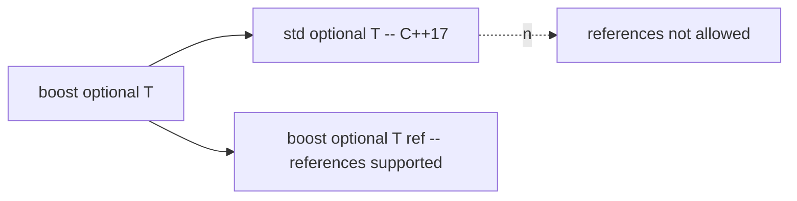

# Boost.Optional

`boost::optional<T>` represents a value that **may or may not be present** — a nullable value that does
not rely on a magic sentinel like `-1`, an empty string, or a null pointer. It is one of Boost's most
influential libraries: it directly inspired C++17's `std::optional`, and it remains useful even today
because it can do something the standard version still cannot — hold optional *references*.

:::info The problem it solves
How do you say "this function might not return a value"? The old answers were all flawed: sentinel
values collide with real data, output parameters plus a `bool` are clumsy, and raw pointers conflate
"optional" with "owning" and "nullable". `optional<T>` makes *absence* a first-class, type-safe state.
:::

## Engaged versus empty

An `optional<T>` is in one of two states: **engaged** (it holds a `T`) or **empty** (it holds nothing,
represented by `boost::none`). Crucially, when empty it does **not** construct a `T` — the storage is
left uninitialised, so there is no requirement that `T` be default-constructible.

```cpp showLineNumbers title="parse.cpp"
#include <boost/optional.hpp>
#include <string>

boost::optional<int> to_int(const std::string& s) {
    try {
        return std::stoi(s);     // engaged
    } catch (...) {
        return boost::none;      // empty — not zero, not -1
    }
}

int main() {
    if (auto n = to_int("42")) {     // contextual bool: true when engaged
        int value = *n;              // safe to dereference here
        (void)value;
    }
}
```

The contextual conversion to `bool` is what makes the `if (auto n = ...)` idiom read so naturally:
an engaged optional is "truthy", an empty one is "falsy".

## Accessing the value

There are three idioms, and the difference between them matters:

```cpp showLineNumbers
#include <boost/optional.hpp>

void demo(boost::optional<int> o) {
    // 1. operator* / operator-> : fast, UNCHECKED. Requires the optional be engaged.
    int a = *o;          // undefined behaviour if o is empty

    // 2. get_value_or / value_or : safe, returns a fallback if empty.
    int b = o.get_value_or(-1);
    int c = o.value_or(-1);   // alias matching the std::optional spelling

    // 3. value() : checked; throws boost::bad_optional_access if empty.
    int d = o.value();

    (void)a; (void)b; (void)c; (void)d;
}
```

:::danger Dereferencing an empty optional is undefined behaviour
`*o` and `o->member` do **not** check engagement. Reading through an empty optional is UB, exactly like
dereferencing a null pointer. Guard with `if (o)`, or use `value_or` / `value()` when you are not
certain.
:::

## In-place construction with emplace

Sometimes the contained type is expensive to move or cannot be copied. `emplace` constructs the value
*directly inside* the optional's storage, and `boost::in_place` does the same at construction time.

```cpp showLineNumbers
#include <boost/optional.hpp>
#include <mutex>

struct Connection {
    Connection(const std::string& host, int port);  // no copy/move
};

boost::optional<Connection> conn;     // empty, no Connection built yet

void open() {
    conn.emplace("db.internal", 5432); // builds in place, no temporary
}
```

## Optional references — a feature `std::optional` lacks

This is the standout capability. `std::optional<T&>` is **ill-formed** — the committee left references
out. `boost::optional<T&>` is fully supported, giving you a rebindable, nullable reference: it behaves
like "a pointer that documents intent".

```cpp showLineNumbers title="optional_ref.cpp"
#include <boost/optional.hpp>
#include <map>
#include <string>

// Return a reference to the found entry, or nothing — without exposing iterators
// or raw pointers in the API.
boost::optional<std::string&> find_name(std::map<int, std::string>& m, int id) {
    auto it = m.find(id);
    if (it == m.end()) return boost::none;
    return it->second;        // binds a reference into the map
}

int main() {
    std::map<int, std::string> users{{1, "ada"}};
    if (auto name = find_name(users, 1)) {
        *name = "Ada Lovelace";   // writes back through the reference
    }
}
```

:::tip When optional references shine
They express "an optional handle to something I do not own" more clearly than `T*`. A pointer might be
null, but it also *might* be owning, or part of an array — an `optional<T&>` says exactly one thing:
"maybe a reference to an existing object."
:::

## Comparison and the empty ordering

Optionals compare sensibly: two empties are equal, an empty compares *less than* any engaged value, and
engaged values compare by their contents. This makes `optional<T>` usable as a map key or in sorted
containers.

```cpp showLineNumbers
#include <boost/optional.hpp>
#include <cassert>

int main() {
    boost::optional<int> a, b = 5, c = 5;
    assert(a < b);        // empty < engaged
    assert(b == c);       // engaged compare by value
    assert(a == boost::none);
}
```

## Boost.Optional versus std::optional



| Feature | `boost::optional` | `std::optional` |
|---------|-------------------|------------------|
| Header | `<boost/optional.hpp>` | `<optional>` |
| Empty token | `boost::none` | `std::nullopt` |
| Safe access | `value_or`, `get_value_or`, `value()` | `value_or`, `value()` |
| Throws on bad `value()` | `bad_optional_access` | `bad_optional_access` |
| Optional **references** | yes | no (ill-formed) |
| `constexpr` support | limited | extensive |
| Monadic ops (`and_then`, `map`) | partial | yes (C++23) |

:::note Which to choose
On C++17 and later, prefer `std::optional` for plain values — it is `constexpr`-friendly, integrates
with the standard, and needs no dependency. Reach for `boost::optional` when you need an optional
*reference*, or when you must support a pre-C++17 toolchain. See
[Boost and the C++ Standard](../00-overview/boost-and-the-standard.md) for the broader lineage story.
:::

## See also

- <Icon icon="lucide:boxes" inline /> [Boost.Variant](./boost-variant.md) — when "maybe a value" becomes "one of several types".
- <Icon icon="lucide:puzzle" inline /> [Boost.Any](./boost-any.md) — type-erased single value, the opposite trade-off.
- <Icon icon="lucide:memory-stick" inline /> [Smart Pointers Overview](../03-smart-pointers-and-memory/smart-ptr-overview.md) — when absence is about *ownership*, not just presence.
- <Icon icon="lucide:arrow-left-right" inline /> [Boost and the C++ Standard](../00-overview/boost-and-the-standard.md) — the `std::optional` lineage.
- <Icon icon="lucide:book-open" inline /> [Boost overview](../readme.md).
