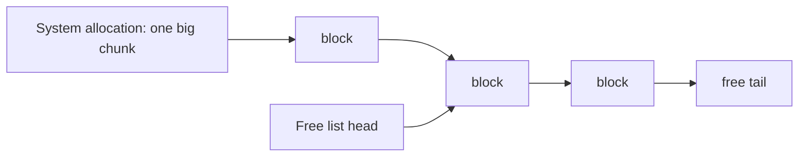

# Boost.Pool

Boost.Pool is a fast memory allocator specialised for handing out **many objects of the same fixed
size**. Instead of asking the system allocator for each object — which is comparatively slow and tends
to fragment the heap — a pool grabs memory in large chunks and carves it into uniform blocks linked on
a free list. Allocation and deallocation become little more than a pointer swap.

:::info When a pool wins
The general-purpose `new`/`malloc` must handle any size and be thread-safe and robust. A pool gives
that up in exchange for speed: same-size blocks, simple bookkeeping, near-zero fragmentation. Ideal
for node-based structures (tree/list nodes), particles, events, or any high-churn small object.
:::

## How it works



A pool keeps a singly linked **free list** threaded through the unused blocks. `malloc()` pops the
head; `free()` pushes a block back. When the free list is empty it requests another chunk from the
system, geometrically larger each time.

## The four interfaces

```cpp showLineNumbers title="pool_demo.cpp"
#include <boost/pool/pool.hpp>
#include <boost/pool/object_pool.hpp>

int main() {
    // 1) Raw, untyped fixed-size blocks:
    boost::pool<> p(sizeof(int));
    int* x = static_cast<int*>(p.malloc());
    p.free(x);

    // 2) Typed pool that constructs/destroys objects:
    boost::object_pool<int> op;
    int* y = op.construct(42);   // placement-new in a pooled block
    op.destroy(y);               // ~int + return block
}                                // object_pool frees everything on destruction
```

| Interface | What it gives you |
|-----------|-------------------|
| `pool<>` | Raw fixed-size blocks (`malloc`/`free`), no construction |
| `object_pool<T>` | Constructs/destroys `T`; frees all remaining objects on scope exit |
| `singleton_pool` | A process-wide named pool, shared across call sites |
| `pool_allocator` / `fast_pool_allocator` | A standard `Allocator` backed by a pool, for STL containers |

## A pool-backed container

```cpp showLineNumbers
#include <boost/pool/pool_alloc.hpp>
#include <list>

// Every node of this list is carved from a pool:
std::list<int, boost::fast_pool_allocator<int>> fast_list;
```

:::tip object_pool is RAII for whole arenas
`object_pool`'s destructor reclaims *every* block it ever handed out, even ones you forgot to
`destroy`. That makes it a tidy "arena": allocate freely during a phase, then drop the whole pool at
the end. Just don't keep using pointers into a pool after it dies.
:::

:::warning Not a general allocator
A pool only allocates one block size efficiently. It is the wrong tool for variable-sized or large
allocations. For alignment-sensitive buffers (SIMD, cache lines) see [Boost.Align](./boost-align.md).
:::

## See also

- [Boost.Align](./boost-align.md) — aligned allocation for SIMD and hardware buffers.
- [Smart Pointers Overview](./smart-ptr-overview.md) — owning pooled objects safely.
- [Boost.Intrusive](../04-containers/intrusive.md) — allocation-free containers that pair well with pools.
